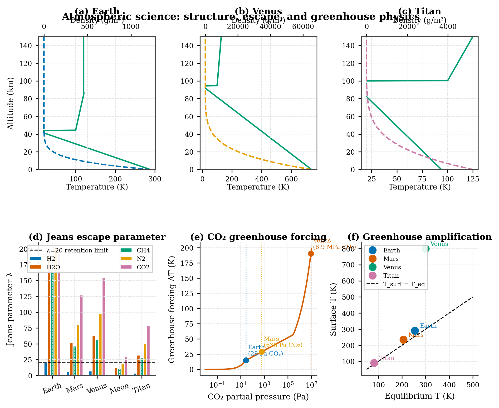

# Planet-RL

A physically consistent planetary science and reinforcement learning toolkit. Every number in the system connects — the planet's interior structure determines its magnetic field, which feeds into the habitability score, which weights the RL reward signal. Nothing is hand-tuned to be convenient.

**11,481 lines across 20 modules.** Three trainable Gymnasium environments. 18 publication-quality figures.

---

## Index

1. [What this is](#1-what-this-is)
2. [Installation](#2-installation)
3. [Planet basics — presets and the generator](#3-planet-basics)
4. [Interior model](#4-interior-model)
5. [Stars and habitable zones](#5-stars-and-habitable-zones)
6. [Atmosphere science](#6-atmosphere-science)
7. [Climate model](#7-climate-model)
8. [Habitability assessment](#8-habitability-assessment)
9. [Orbital mechanics](#9-orbital-mechanics)
10. [Ground track and coverage](#10-ground-track-and-coverage)
11. [Surface energy](#11-surface-energy)
12. [Tidal dynamics](#12-tidal-dynamics)
13. [Mission design](#13-mission-design)
14. [Observational signatures](#14-observational-signatures)
15. [Interplanetary transfers](#15-interplanetary-transfers)
16. [Population analysis](#16-population-analysis)
17. [RL environments](#17-rl-environments)
18. [Figure reference](#18-figure-reference)
19. [Known limitations](#19-known-limitations)
20. [Module summary](#20-module-summary)

---

## 1. What this is

Planet-RL does two things that are usually separate:

**Planetary science simulation.** Given a planet's mass, radius, and composition, it derives everything else — interior layer structure, magnetic field strength, atmospheric escape rate, surface temperature, greenhouse warming, habitability score, orbital perturbations, and what the planet would look like to a telescope. All quantities are causally connected: changing the interior model changes J2, which changes the frozen orbit eccentricity, which changes the science orbit reward.

**Reinforcement learning environments.** Two Gymnasium-compatible environments use the physics directly. `OrbitalInsertionEnv` trains agents to insert a spacecraft into orbit around randomly generated planets. `InterplanetaryEnv` is the full task — choose a departure window, execute a heliocentric transfer, and capture at the target planet. Both use the real physics, not toy approximations.

The causal chain that ties them together:

```
Interior structure
  → moment of inertia → J2 oblateness → nodal precession rate
  → frozen orbit eccentricity → orbit quality bonus in RL reward

  → core solidification → dynamo activity → magnetic field strength
  → atmospheric retention → surface pressure → drag on spacecraft

  → heat flux → surface temperature (with greenhouse) → habitability score
  → curriculum ordering → episode difficulty in training
  → habitability bonus in RL reward
```

---

## 2. Installation

```bash
git clone https://github.com/yourname/Planet-RL
cd Planet-RL
pip install numpy matplotlib gymnasium
```

Optional (needed for full atmosphere and climate models):
```bash
pip install scipy
```

Run the science demo to verify everything works:
```bash
python science_demo.py
```

This generates all 10 science figures to `./science_figures/`.

---

## 3. Planet basics

**Files:** `core/planet.py`, `core/generator.py`

A `Planet` object holds all physical properties and exposes derived quantities as methods. You can use one of five named presets or generate planets procedurally.

### Presets

Five solar system analogues are built in:

```python
from core.generator import PRESETS

earth = PRESETS["earth"]()
mars  = PRESETS["mars"]()
venus = PRESETS["venus"]()
moon  = PRESETS["moon"]()
titan = PRESETS["titan"]()

print(earth.radius / 1e3)                     # 6371 km
print(mars.surface_gravity)                   # 3.73 m/s²
print(venus.atmosphere.surface_pressure)      # 9.2e6 Pa
```

### Random generation

```python
from core.generator import PlanetGenerator

gen = PlanetGenerator(seed=42)

planet = gen.generate(
    atmosphere_enabled     = True,
    oblateness_enabled     = True,
    magnetic_field_enabled = True,
    terrain_enabled        = True,
    moons_enabled          = True,
)

print(planet.summary())
```

The generator spans 0.1–4× Earth radius and 0.003–100× Earth mass. Atmosphere composition, J2, magnetic dipole moment, and moon count are all randomised consistently with the planet's size and density.

### Key properties

| Property | Description | Units |
|---|---|---|
| `planet.mass` | Total mass | kg |
| `planet.radius` | Mean radius | m |
| `planet.mean_density` | Bulk density | kg/m³ |
| `planet.surface_gravity` | Surface gravitational acceleration | m/s² |
| `planet.escape_velocity` | Escape speed | m/s |
| `planet.mu` | Gravitational parameter | m³/s² |
| `planet.circular_orbit_speed(alt)` | Circular orbit speed at altitude | m/s |
| `planet.atmosphere.surface_pressure` | Surface atmospheric pressure | Pa |
| `planet.oblateness.J2` | Second gravitational moment | — |

**Figures from this module:**

*Five solar system presets — cross-sections and atmosphere profiles:*


*Six randomly generated planets — cross-sections and atmosphere profiles:*


*Batch statistics across 50 randomly generated planets:*


---

## 4. Interior model

**File:** `core/interior.py`

Attaching an interior model lets the planet derive physically consistent J2, magnetic field strength, heat flux, and moment of inertia from its bulk density rather than using hand-set values.

```python
from core.interior import interior_from_bulk_density

planet.interior = interior_from_bulk_density(planet.mean_density)

# These now return physics-derived values instead of defaults
j2   = planet.derived_J2()                # gravitational oblateness
B    = planet.derived_magnetic_field_T()  # surface B-field in Tesla
q    = planet.derived_heat_flux()         # internal heat flux W/m²
moi  = planet.derived_MoI()              # moment of inertia C/MR²
```

You can also specify composition directly:

```python
from core.interior import InteriorConfig

planet.interior = InteriorConfig.earth_like()
planet.interior = InteriorConfig.from_bulk_density(5500)
```

### How it works

The model divides the planet into layers — inner core, outer core, lower mantle, upper mantle, crust — with densities set by bulk density and a rocky/icy composition flag. From the layer structure it computes:

- **J2** — from the moment of inertia, which depends on how mass is distributed radially
- **Magnetic field** — from whether the outer core is liquid (requires sufficient heat flux and rotation to sustain a dynamo)
- **Heat flux** — from the radiogenic element budget, scaled by planet mass
- **MoI** — directly integrated from the layer density profile

### Calibration

| Quantity | Earth (model) | Earth (real) | Mars (model) | Mars (real) |
|---|---|---|---|---|
| J2 | 1.15×10⁻³ | 1.08×10⁻³ | 1.52×10⁻³ | 1.96×10⁻³ |
| MoI C/MR² | 0.348 | 0.331 | 0.360 | 0.366 |
| Heat flux | 21.6 mW/m² | 87 mW/m² | 8.9 mW/m² | ~18 mW/m² |

Heat flux is ~4× low. J2 and MoI are within 5–22%.

**Figure — interior-derived quantities across all five solar system analogues:**


---

## 5. Stars and habitable zones

**File:** `core/star.py`

Seven stellar presets covering M through G spectral types.

```python
from core.star import star_sun, STAR_PRESETS

sun      = star_sun()
proxima  = STAR_PRESETS["proxima"]()
trappist = STAR_PRESETS["trappist1"]()
# also: tau_ceti, kepler452, alpha_centauri_a, eps_eridani

# Habitable zone boundaries (Kopparapu 2013)
print(sun.hz_inner_m / 1.496e11)    # ~0.975 AU
print(sun.hz_outer_m / 1.496e11)    # ~1.706 AU

# Stellar flux at a distance
flux = sun.flux_at_distance(1.496e11)    # W/m² at 1 AU

# Whether a distance is in the HZ
print(sun.in_habitable_zone(1.496e11))   # True

# XUV flux (drives atmospheric escape)
xuv = sun.xuv_flux_at_distance(1.496e11)

# Orbital period at a given distance
T = sun.orbital_period(1.496e11)    # seconds
```

Attach a star to a planet to enable habitability scoring and climate calculations:

```python
planet.star_context       = sun
planet.orbital_distance_m = 1.496e11   # 1 AU
```

**Figure — habitable zones and XUV flux for all seven stellar presets:**


---

## 6. Atmosphere science

**File:** `core/atmosphere_science.py`

Multi-layer atmosphere model with temperature-dependent density profiles, thermal escape, and greenhouse forcing.

```python
from core.atmosphere_science import MultiLayerAtmosphere, analyse_atmosphere

# Build layered atmosphere from the planet's atmosphere config
atm = MultiLayerAtmosphere.from_atmosphere_config(planet.atmosphere, planet)

# Density at altitude
rho = atm.density_at(50_000)    # kg/m³ at 50 km

# Full analysis (needs star and orbital distance attached to planet)
result = analyse_atmosphere(planet, sun, 1.496e11)
print(result["surface_temp_K"])     # surface temperature
print(result["greenhouse_dT_K"])    # greenhouse warming above equilibrium
print(result["jeans_escape_rate"])  # atmospheric escape kg/s
```

### Atmosphere compositions

| Name | Used for |
|---|---|
| `EARTH_LIKE` | N₂/O₂, moderate greenhouse |
| `CO2_THIN` | Mars-like, cold and thin |
| `CO2_THICK` | Venus-like, extreme greenhouse |
| `NITROGEN` | Titan-like, dense and cold |
| `METHANE` | Outer solar system bodies |
| `HYDROGEN` | Gas dwarfs, high escape rate |

### Jeans escape

The model computes the thermal escape rate using the Jeans parameter — the ratio of gravitational to thermal energy at the exobase. Small planets with hot, lightweight atmospheres lose gas quickly; massive, cold planets retain theirs over geological timescales.

**Figure — multi-layer profiles, Jeans escape rates, and greenhouse warming:**


---

## 7. Climate model

**File:** `core/climate.py`

A 1D energy balance model that finds stable surface temperatures accounting for ice-albedo feedback and the carbonate-silicate thermostat.

```python
from core.climate import EnergyBalanceModel, find_bifurcation_points

ebm = EnergyBalanceModel(planet, star)

# Equilibrium temperature at a given orbital distance
result = ebm.solve(1.496e11)
print(result.T_surface_K)     # 288 K for Earth
print(result.climate_state)   # "warm_habitable"
print(result.OLR_W_m2)        # outgoing longwave radiation

# Snowball and runaway greenhouse transition distances
bif = find_bifurcation_points(planet, star)
print(bif.snowball_distance_au)    # distance where planet freezes over
print(bif.runaway_distance_au)     # distance where runaway greenhouse starts
print(bif.habitable_range_au)      # (inner, outer) habitable window in AU
```

### Climate states

| State | Meaning |
|---|---|
| `warm_habitable` | Liquid water possible, moderate temperature |
| `snowball` | Fully ice-covered, trapped by high albedo |
| `moist_greenhouse` | Water vapour feedback accelerating |
| `runaway_greenhouse` | Venus-like, oceans have evaporated |

### Calibration

| Planet | Model T | Real T | State |
|---|---|---|---|
| Earth | 288 K | 288 K | warm_habitable |
| Mars | 213 K | 210 K | snowball |
| Venus | 647 K | 737 K | runaway_greenhouse |

Earth's greenhouse warming is 19 K vs 33 K real — water vapour feedback is not yet included, only CO₂.

---

## 8. Habitability assessment

**File:** `core/habitability.py`

Scores a planet on ten factors and returns a 0–1 composite score with an A–F grade and a written report.

```python
from core.habitability import assess_habitability

planet.star_context       = sun
planet.orbital_distance_m = 1.496e11

ha = assess_habitability(planet, sun, 1.496e11)

print(ha.overall_score)   # 0.842 for Earth
print(ha.grade)           # "A"
print(ha.report())        # full written assessment
```

### The ten factors

| Factor | What it measures |
|---|---|
| Stellar flux | Is the planet receiving the right amount of energy? |
| Surface temperature | Is liquid water possible? |
| Atmospheric pressure | Can surface liquid water exist? |
| Escape velocity | Can the planet retain its atmosphere long-term? |
| Magnetic field | Is there protection from stellar wind stripping? |
| Tidal locking | Is the planet tidally locked to its star? |
| Stellar activity | How much harmful XUV radiation reaches the surface? |
| Greenhouse warming | Is there enough warming to keep surfaces above freezing? |
| Orbital stability | Is the orbit stable over geological timescales? |
| Water inventory | Is there likely surface water? |

Each factor scores 0–1. The overall score is the geometric mean. Any factor scoring below 0.01 vetoes the planet (disqualifying condition).

### Solar system calibration

| Planet | Score | Grade |
|---|---|---|
| Earth | 0.842 | A |
| Mars | 0.361 | D |
| Venus | 0.238 | F |
| Moon | 0.276 | D |
| Titan | 0.135 | F |

**Figure — habitability radar charts for all five presets plus a random planet:**


---

## 9. Orbital mechanics

**File:** `core/orbital_analysis.py`

J2-driven secular perturbations, sun-synchronous orbit design, frozen orbit calculation, atmospheric drag lifetime, and station-keeping budgets.

```python
from core.orbital_analysis import (
    J2Perturbations, SunSynchronousOrbit,
    FrozenOrbit, AtmosphericDrag
)
import math

# Nodal precession rate from J2
j2p       = J2Perturbations(planet)
omega_dot = j2p.nodal_precession_rate(
    alt=500_000, inc=math.radians(98))    # rad/s

# Sun-synchronous inclination for a given altitude
ss_inc = SunSynchronousOrbit.sun_sync_inclination(
    planet, 500_000, star_yr=365.25*86400)
print(f"Sun-sync inclination: {math.degrees(ss_inc):.1f}°")

# Frozen orbit eccentricity — eccentricity that minimises drift
fe = FrozenOrbit.frozen_eccentricity(
    planet, planet.radius + 500_000, math.radians(98))
print(f"Frozen eccentricity: {fe:.5f}")

# Orbit drag lifetime
drag  = AtmosphericDrag(planet)
decay = drag.lifetime_days(
    alt=300_000, area=10.0, mass=1000.0, Cd=2.2)
print(f"Orbit lifetime: {decay:.0f} days")
```

**Figure — J2 precession rates, sun-sync inclinations, frozen orbit map, and drag lifetimes:**


---

## 10. Ground track and coverage

**File:** `core/ground_track.py`

Computes the sub-satellite ground track, builds coverage maps, and finds pass times over ground targets.

```python
from core.ground_track import GroundTrack, CoverageMap

# Ground track
gt       = GroundTrack(planet, alt=500_000, inc=math.radians(98))
lats, lons = gt.compute(n_orbits=1)

# Coverage over N days
cov      = CoverageMap(planet, alt=500_000, inc=math.radians(98))
cov.simulate(days=3)
fraction = cov.coverage_fraction()    # 0–1
grid     = cov.coverage_grid()        # 2D array [lat × lon]

# Next pass over a target
next_pass = gt.next_pass(lat=35.0, lon=135.0, from_time=0)
```

**Figure — ground track and 3-day coverage map:**


---

## 11. Surface energy

**File:** `core/surface_energy.py`

Insolation maps, surface temperature maps across seasons, and polar ice extent.

```python
from core.surface_energy import SurfaceEnergyMap

planet.star_context       = sun
planet.orbital_distance_m = 1.496e11

sem = SurfaceEnergyMap(planet, sun)

# Insolation at a specific location and time
flux = sem.insolation_at(lat=45.0, lon=0.0, day_of_year=172)    # W/m²

# Full 2D surface temperature map
T_map = sem.temperature_map(day_of_year=172)    # [lat × lon] in K

# Latitude above which permanent ice is stable
ice_lat = sem.polar_ice_latitude()
```

**Figure — insolation and temperature maps at solstice, equinox, and perihelion:**


---

## 12. Tidal dynamics

**File:** `core/tidal.py`

Tidal heating rate, locking timescale, Roche limit, and orbital migration.

```python
from core.tidal import TidalModel

tidal = TidalModel(planet, star)

heating  = tidal.surface_heating_rate()        # W/m²
t_lock   = tidal.locking_timescale()           # seconds
locked   = tidal.is_tidally_locked(planet.orbital_distance_m)
roche    = tidal.roche_limit()                 # metres — minimum stable moon orbit
da_dt    = tidal.orbital_migration_rate()      # m/s — orbital drift rate
```

**Figure — tidal heating, locking map, Roche limits, and orbital migration timescales:**


---

## 13. Mission design

**Files:** `core/mission.py`, `core/heliocentric.py`, `core/soi.py`, `core/launch_window.py`

Delta-V budgets, Lambert solver, porkchop analysis, and SOI transitions.

### Delta-V budget

```python
from core.soi import patched_conic_budget, HyperbolicDeparture, HyperbolicArrival

G = 6.674e-11

budget = patched_conic_budget(
    departure_planet_mass    = earth.mass,
    departure_planet_radius  = earth.radius,
    departure_parking_alt    = 300_000,
    arrival_planet_mass      = mars.mass,
    arrival_planet_radius    = mars.radius,
    arrival_periapsis_alt    = 300_000,
    arrival_target_alt       = 300_000,
    vinf_departure_m_s       = 2945.0,
    vinf_arrival_m_s         = 2648.0,
)
print(budget["dv_total_m_s"])      # ~5960 m/s for Earth→Mars

# Individual burns
dep = HyperbolicDeparture(2945.0, 300_000, earth.radius, G*earth.mass)
print(dep.delta_v_m_s)             # 3591 m/s departure burn

arr = HyperbolicArrival(2648.0, 300_000, mars.radius, G*mars.mass, 300_000)
print(arr.dv_total_m_s)            # 2091 m/s capture + circularise
```

### Lambert solver

```python
from core.heliocentric import LambertSolver, KeplerPropagator, planet_state, MU_SUN, AU
import numpy as np

solver = LambertSolver(MU_SUN)
prop   = KeplerPropagator(MU_SUN)

r1v, v1p = planet_state(1.0*AU, 0.0)           # Earth at departure
r2v, v2p = planet_state(1.524*AU, 260*86400)   # Mars 260 days later

v1_sc, v2_sc = solver.solve(r1v, r2v, 260*86400)

vinf_dep = np.linalg.norm(v1_sc - v1p)    # departure excess speed m/s
vinf_arr = np.linalg.norm(v2_sc - v2p)    # arrival excess speed m/s

# Full trajectory array for plotting (400 points)
times = np.linspace(0, 260*86400, 400)
traj  = prop.orbit_at_time(r1v, v1_sc, times)    # (400, 6) array [x,y,z,vx,vy,vz]
```

### Porkchop grid and launch windows

```python
from core.launch_window import PorkchopData
import numpy as np

dep_days = np.linspace(0, 780, 50)
arr_days = np.linspace(150, 980, 50)

pc = PorkchopData.compute(
    1.0*AU, 1.524*AU,
    dep_days, arr_days,
    dep_name="Earth", arr_name="Mars"
)

print(pc.summary())
# Min C3: 8.7 km²/s²,  Min v∞ arr: 2.6 km/s

best = pc.best_window(max_c3=15.0, max_vinf_arr=5.0)
print(best.report())
```

**Figures — mission design delta-V, heliocentric transfer, and porkchop:**

*Delta-V budgets, aerobraking, and mission overview:*


*Heliocentric transfer arc coloured by spacecraft speed:*


*Porkchop — launch energy (C3) over one Earth–Mars synodic period:*


*Porkchop — arrival excess speed with time-of-flight contours:*


*4-panel mission dashboard (transfer arc, C3, arrival v∞, SOI approach):*


---

## 14. Observational signatures

**File:** `core/observation.py`

What the planet would look like to a telescope — transit depth, radial velocity amplitude, transmission spectroscopy metric, and a basic transmission spectrum.

```python
from core.observation import (
    transit_depth_ppm,
    rv_semi_amplitude,
    transmission_spectroscopy_metric,
    characterise_observations,
)
import math

G = 6.674e-11
T_orb = 2*math.pi*math.sqrt(
    planet.orbital_distance_m**3 / (G*sun.mass))

depth = transit_depth_ppm(planet.radius, sun.radius)    # Earth: 84 ppm
K     = rv_semi_amplitude(planet.mass, sun.mass, T_orb) # Earth: 0.089 m/s
tsm   = transmission_spectroscopy_metric(planet, sun, planet.orbital_distance_m)

# Full summary in one call
sig = characterise_observations(planet, sun, planet.orbital_distance_m)
print(sig.transit_depth_ppm)
print(sig.rv_semi_amplitude_m_s)
print(sig.tsm)
print(sig.biosignature_flags)
```

### Calibration

| Quantity | Model | Real |
|---|---|---|
| Earth transit depth | 83.9 ppm | 84 ppm |
| Earth transit duration | 13.09 hr | ~13 hr |
| Earth transit probability | 0.465% | 0.46% |
| Earth RV K | 0.089 m/s | 0.089 m/s |
| Jupiter RV K | 12.46 m/s | 12.5 m/s |
| TRAPPIST-1e TSM | 19.7 | ~14 |

---

## 15. Interplanetary transfers

**Files:** `core/heliocentric.py`, `core/soi.py`, `core/launch_window.py`

### SOI transitions

```python
from core.soi import SphereOfInfluence, laplace_soi_radius
import numpy as np

soi_mars = SphereOfInfluence.from_planet(mars, 1.524*AU)
print(soi_mars.r_laplace / 1e6)    # 577 Mm

inside = soi_mars.is_inside(sc_helio_pos, mars_helio_pos)

# Frame transform at SOI entry
r_planet, v_planet = soi_mars.to_planet_frame(
    sc_helio_pos, sc_helio_vel,
    mars_helio_pos, mars_helio_vel
)

vinf = soi_mars.arrival_vinf(sc_helio_vel, mars_helio_vel)
```

### RL decision space

```python
from core.launch_window import LaunchDecisionSpace

space = LaunchDecisionSpace(
    1.0*AU, 1.524*AU,
    n_dep=20, n_arr=20,
    window_duration_days=780,
)

# Cost for a chosen (dep_idx, arr_idx) grid point
cost = space.cost(dep_idx=10, arr_idx=12)
# {"valid": True, "c3": 9.4, "vinf_arr": 3.1, "tof_days": 294}

obs  = space.observation(10, 12)    # 6-element obs vector for the agent
r    = space.reward(10, 12)         # scalar reward in [-1, 0]

best_i, best_j = space.best_action()
```

---

## 16. Population analysis

**File:** `core/population.py`  
**Script:** `population_demo.py`

Generate a large population of planets and analyse their statistical properties.

### Generate or load

```python
from core.population import PlanetPopulation

pop = PlanetPopulation.generate(n=500, seed=42)
pop.save("population_500.csv")

pop = PlanetPopulation.load("population_500.csv")    # load existing
```

### Command-line script

```bash
python population_demo.py                              # 500 planets
python population_demo.py --n 2000                    # larger population
python population_demo.py --fast                      # 100 planets, quick test
python population_demo.py --load population_500.csv   # use your own CSV
```

### CSV columns

| Column | Description | Units |
|---|---|---|
| `mass_earth` | Planet mass | M⊕ |
| `radius_earth` | Planet radius | R⊕ |
| `density` | Bulk density | kg/m³ |
| `gravity` | Surface gravity | m/s² |
| `escape_km_s` | Escape velocity | km/s |
| `j2` | Oblateness coefficient | — |
| `b_uT` | Surface magnetic field | μT |
| `heat_mW` | Internal heat flux | mW/m² |
| `moi` | Moment of inertia factor C/MR² | — |
| `has_dynamo` | Active magnetic dynamo | 0/1 |
| `has_atm` | Atmosphere present | 0/1 |
| `P_bar` | Surface pressure | bar |
| `T_surf_K` | Surface temperature | K |
| `dT_GH_K` | Greenhouse warming | K |
| `hab_score` | Habitability score | 0–1 |
| `hab_grade` | Letter grade | A–F |
| `in_hz` | Inside stellar habitable zone | 0/1 |
| `star` | Host star name | — |
| `dist_au` | Orbital distance | AU |
| `composition` | Bulk composition | iron / rocky / water-rich / gas-dwarf |
| `transit_ppm` | Transit depth vs host star | ppm |
| `rv_K_ms` | RV semi-amplitude vs host star | m/s |

### Key results from 500-planet run

```
Potentially habitable (score > 0.5):  82 / 500  (16.4%)
In habitable zone:                    500 / 500 (all placed there)
Has active dynamo:                    398 / 500  (79.6%)
Composition: water-rich 60%, rocky 38%, iron 1.4%, gas-dwarf 0.6%
Habitability mean 0.402, std 0.128
```

Only 16.4% of randomly generated planets score above 0.5. This is why the curriculum mode in `OrbitalInsertionEnv` is useful — without it, most training episodes are on uninhabitable planets where the habitability reward bonus is negligible.

**Figures — population statistics across 500 planets:**

*Mass-radius diagram with Zeng (2013) composition curves, coloured by habitability score:*


*Habitability score distribution with A–F grade boundaries:*


*Pearson correlation matrix between all physical properties:*


*Full 4-panel population statistics dashboard:*


---

## 17. RL environments

**Files:** `core/env.py`, `core/interplanetary_env.py`

### OrbitalInsertionEnv

Single-planet orbital insertion. The agent fires burns to slow from a hyperbolic approach into a stable circular orbit.

```python
from core.env import OrbitalInsertionEnv

env = OrbitalInsertionEnv(
    planet_preset    = "earth",        # or randomize_planet=True
    curriculum_mode  = True,           # easy → hard by habitability score

    use_science_atmosphere = True,     # multi-layer atmosphere drag
    use_science_j2         = True,     # J2 from interior model
    attach_star            = True,     # random star + HZ orbital distance

    obs_dim         = 18,              # 18 = full,  10 = legacy
    target_altitude = 300_000,         # m
    wet_mass        = 1000.0,          # kg
    dry_mass        = 300.0,
    max_thrust      = 500.0,           # N
    Isp             = 320.0,           # s
)

obs, info = env.reset()
print(info["planet"])        # planet name
print(info["j2"])            # interior-derived J2
print(info["habitability"])  # 0–1 score
print(info["star"])          # host star name
print(info["atm_model"])     # "multi-layer" or "exponential"
```

### Observation vector (obs_dim=18)

| Index | Feature | Range |
|---|---|---|
| 0 | altitude / target altitude | 0–3 |
| 1 | speed / circular orbit speed | 0–2 |
| 2 | flight path angle / π | −1–1 |
| 3 | eccentricity | 0–2 |
| 4 | fuel fraction | 0–1 |
| 5 | heat load / heat limit | 0–1 |
| 6 | planet radius / R⊕ | 0–5 |
| 7 | surface gravity / 9.81 | 0–5 |
| 8 | atmosphere density / 1.225 | 0–10 |
| 9 | target altitude / planet radius | 0–1 |
| 10 | J₂ × 1000 | 0–3 |
| 11 | magnetic field / 60 μT | 0–2 |
| 12 | surface pressure / 1 bar | 0–100 |
| 13 | habitability score | 0–1 |
| 14 | star type (0=M, 0.7=G, 1=A) | 0–1 |
| 15 | orbital distance / 5 AU | 0–1 |
| 16 | frozen orbit eccentricity × 100 | 0–1 |
| 17 | sun-sync inclination / 180° | 0–1 |

Indices 0–9 are the dynamic state (changes every step). Indices 10–17 are the planet context (constant per episode — encodes the task identity for generalisation).

### Curriculum mode

```python
env = OrbitalInsertionEnv(
    randomize_planet      = True,
    curriculum_mode       = True,
    curriculum_pool_size  = 200,
    curriculum_easy_first = True,     # high habitability → easy
)
# Episodes go from Earth-like to progressively more exotic planets
```

---

### InterplanetaryEnv

Full planet-to-planet mission in three sequential phases within a single episode.

```python
from core.interplanetary_env import InterplanetaryEnv

env = InterplanetaryEnv(
    departure_planet_name = "earth",
    arrival_planet_name   = "mars",
    n_dep_slots = 20,
    n_arr_slots = 20,
    wet_mass    = 1500.0,    # needs fuel for departure AND capture
    dry_mass    = 400.0,
)

obs, info = env.reset()
```

### The three phases

**Phase A — Window selection** (`info["phase"] == "window"`)

The agent sweeps `action[0]` (departure slot) and `action[1]` (arrival slot) across the porkchop grid, then commits when `action[2] > 0`. On commit, the Lambert solver runs, the departure burn is applied via the rocket equation, and the spacecraft is placed at the departure planet with the correct heliocentric velocity.

```python
# Commit to the best available window immediately
bi, bj = env._space.best_action()
a = np.array([(bi/19)*2-1, (bj/19)*2-1, 0.9, 0.0])
obs, r, done, trunc, info = env.step(a)
print(info["window_c3"])       # C3 in km²/s²
print(info["dv_departure"])    # departure burn in m/s
```

**Phase B — Heliocentric cruise** (`info["phase"] == "cruise"`)

One step = one simulated day. The Kepler propagator advances the spacecraft. The agent can fire mid-course corrections with `action[3]` (magnitude) and `action[0:3]` (RTN direction). The phase ends automatically when the spacecraft enters the target SOI.

```python
while info["phase"] == "cruise":
    obs, r, done, trunc, info = env.step(np.zeros(4))   # coast
```

**Phase C — SOI capture** (`info["phase"] == "capture"`)

Identical physics to `OrbitalInsertionEnv`. The agent fires retrograde burns to circularise at the target altitude.

```python
while not (done or trunc):
    obs, r, done, trunc, info = env.step(np.array([-0.8, 0.0, 0.0, 0.0]))
```

### Observation vector (28 floats)

| Index | Feature |
|---|---|
| 0 | Phase (0=window, 0.5=cruise, 1=capture) |
| 1–6 | Window context: dep slot, arr slot, C3, v∞_arr, ToF, valid flag |
| 7–13 | Heliocentric state: r, dist to target, v, angle to target, elapsed time, fuel, in SOI |
| 14–23 | Planetocentric capture state (same as OrbitalInsertionEnv obs[0:10]) |
| 24–27 | Target planet: habitability, mass, radius, surface pressure |

### Typical episode — Earth to Mars

| Phase | Steps | Simulated time | Key numbers |
|---|---|---|---|
| Window | 1 | instant | C3 = 9.7 km²/s², departure ΔV = 3638 m/s |
| Cruise | ~264 | 264 days | arrives with 440 kg fuel remaining |
| Capture | ~500 | ~80 min | capture ΔV = 2153 m/s, feasible |

---

## 18. Figure reference

| Figure | File | What it shows |
|---|---|---|
| fig1_presets | `figures/fig1_presets.png` | Solar system preset cross-sections and atmosphere profiles |
| fig2_random | `figures/fig2_random.png` | Six randomly generated planets |
| fig6_batch_stats | `figures/fig6_batch_stats.png` | Batch statistics across 50 random planets |
| fig01 | `science_figures/fig01_solar_system_comparison.png` | Cross-sections and interior pie charts for all 5 presets |
| fig02 | `science_figures/fig02_interior_profiles.png` | J2, B-field, heat flux, MoI from interior model |
| fig03 | `science_figures/fig03_star_habitable_zones.png` | HZ boundaries and XUV flux for 7 stellar presets |
| fig04 | `science_figures/fig04_atmosphere_science.png` | Multi-layer profiles, Jeans escape, greenhouse warming |
| fig05 | `science_figures/fig05_habitability_radar.png` | Habitability radar charts |
| fig06 | `science_figures/fig06_orbital_mechanics.png` | J2 precession, sun-sync, frozen orbit, drag lifetimes |
| fig07 | `science_figures/fig07_ground_track_coverage.png` | Ground track and 3-day coverage map |
| fig08 | `science_figures/fig08_surface_energy.png` | Insolation and temperature maps across seasons |
| fig09 | `science_figures/fig09_tidal_dynamics.png` | Tidal heating, locking timescales, Roche limits |
| fig10 | `science_figures/fig10_mission_design.png` | Delta-V budgets, aerobraking, mission overview |
| fig11 | `science_figures/fig11_heliocentric_transfer.png` | Earth→Mars transfer arc |
| fig12 | `science_figures/fig12_porkchop_c3.png` | C3 porkchop over one synodic period |
| fig13 | `science_figures/fig13_porkchop_vinf.png` | Arrival v∞ porkchop with ToF contours |
| fig14 | `science_figures/fig14_transfer_dashboard.png` | 4-panel mission dashboard |
| fig15 | `science_figures/fig15_mass_radius.png` | Mass-radius diagram with composition curves |
| fig16 | `science_figures/fig16_habitability_distribution.png` | Habitability score histogram |
| fig17 | `science_figures/fig17_correlation_heatmap.png` | Pearson correlation heatmap |
| fig18 | `science_figures/fig18_population_dashboard.png` | Full population statistics dashboard |

---

## 19. Known limitations

- **Heat flux** is ~4× lower than Earth's real value. The model uses radiogenic budget only and omits secular cooling.
- **Venus dynamo** is incorrectly flagged as active. Venus has no magnetic field despite being Earth-sized — the model uses mass-based heuristics that fail here.
- **Greenhouse warming** underestimates Earth by ~40% (model: 19 K, real: 33 K). Water vapour feedback is not yet implemented — only CO₂ forcing.
- **Mars J2** is ~22% low due to the empirical power-law interior fit.
- **Lambert solver** cannot handle exactly 0° or 180° transfer angles (collinear geometry). A 0.001 rad offset resolves it in practice.

---

## 20. Module summary

| Module | Lines | Role |
|---|---|---|
| `planet.py` | 472 | Central planet object |
| `generator.py` | 291 | Procedural generator and presets |
| `interior.py` | 618 | Layered interior model |
| `star.py` | 475 | Stellar model and habitable zones |
| `atmosphere_science.py` | 828 | Multi-layer atmosphere |
| `climate.py` | 816 | 1D energy balance model |
| `habitability.py` | 682 | 10-factor habitability scorer |
| `orbital_analysis.py` | 819 | J2, sun-sync, frozen orbit, drag |
| `ground_track.py` | 492 | Coverage maps and pass finder |
| `surface_energy.py` | 460 | Insolation and temperature maps |
| `tidal.py` | 517 | Tidal heating and locking |
| `mission.py` | 696 | Delta-V budgets and aerobraking |
| `observation.py` | 654 | Transit, RV, TSM |
| `heliocentric.py` | 899 | Lambert solver and cruise propagator |
| `soi.py` | 277 | SOI transitions and frame transforms |
| `launch_window.py` | 213 | Porkchop and RL decision space |
| `population.py` | 542 | Batch population statistics |
| `physics.py` | 292 | RK4 integrator and spacecraft state |
| `env.py` | 667 | OrbitalInsertionEnv |
| `interplanetary_env.py` | 771 | InterplanetaryEnv |