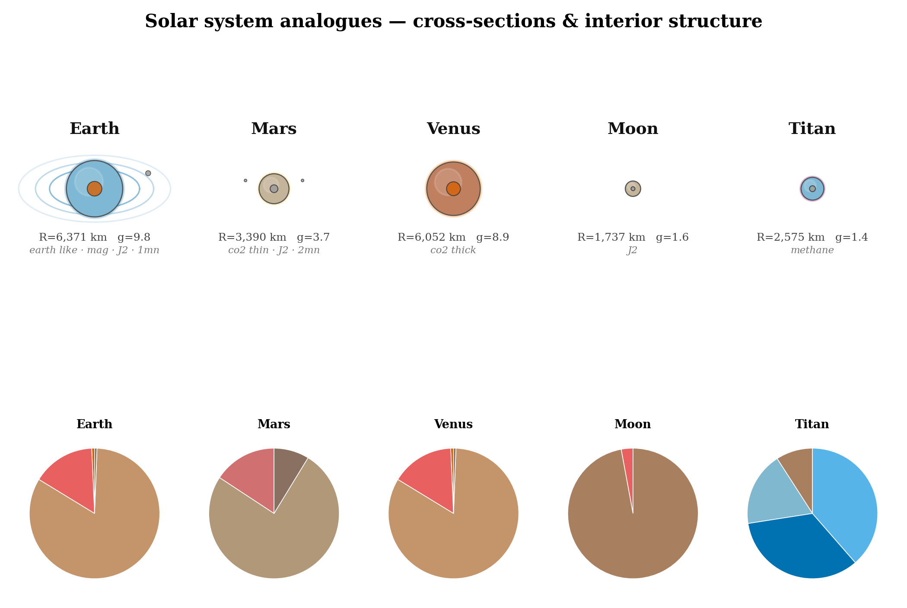

# 🪐 Planet-RL — Planetary Science & Mission Design Toolkit

> A procedural planet simulation, orbital mechanics sandbox, and planetary science workbench — built for RL research but grown into a full scientific toolkit.

---

## Table of Contents

1. [What This Is](#1-what-this-is)
2. [Project Structure](#2-project-structure)
3. [Installation](#3-installation)
4. [Quick Start](#4-quick-start)
5. [Module Reference](#5-module-reference)
   - [5.1 Planet & Generator](#51-planet--generator-coreplanetpy-coregeneratorpy)
   - [5.2 Interior Model](#52-interior-model-coreinteriorpy)
   - [5.3 Stars](#53-stars-corestarpy)
   - [5.4 Atmosphere Science](#54-atmosphere-science-coreatmosphere_sciencepy)
   - [5.5 Habitability Assessment](#55-habitability-assessment-corehabitabilitypy)
   - [5.6 Orbital Analysis](#56-orbital-analysis-coreorbital_analysispy)
   - [5.7 Ground Track & Coverage](#57-ground-track--coverage-coreground_trackpy)
   - [5.8 Surface Energy](#58-surface-energy-coresurface_energypy)
   - [5.9 Tidal Dynamics](#59-tidal-dynamics-coretidалpy)
   - [5.10 Mission Design](#510-mission-design-coremissionpy)
   - [5.11 RL Environment](#511-rl-environment-coreenvpy)
   - [5.12 Visualisation](#512-visualisation-visualizationvisualizerpy)
6. [Science Demo Script](#6-science-demo-script)
7. [Visualisations](#7-visualisations)
8. [Physics & Calibration Notes](#8-physics--calibration-notes)
9. [RL Training Guide](#9-rl-training-guide)
10. [TODO & Roadmap](#10-todo--roadmap)
11. [Dependencies](#11-dependencies)
12. [License](#12-license)

---

## 1. What This Is

Planet-RL started as a reinforcement learning training environment for orbital insertion manoeuvres. It has since grown into a comprehensive planetary science and mission design toolkit — **~7,000 lines of physics code** across 13 core modules.

The project sits at the intersection of three domains:

- **Planetary science** — physically self-consistent planet models where interior structure drives magnetic fields, J2 drives orbital precession, and atmospheric composition drives surface temperature
- **Mission engineering** — orbital design (sun-synchronous, frozen, repeat ground-track), aerobraking campaigns, full ΔV budgets, Lambert transfers, porkchop plots
- **RL research** — a full Gymnasium-compatible environment for generalisation across procedurally generated planets

The guiding principle is that **every derived quantity is computed, not hand-set**. J2 comes from the moment of inertia and rotation rate. The magnetic field comes from the dynamo scaling law applied to the iron core. Surface temperature comes from stellar flux plus greenhouse forcing. Nothing is a magic number.

---

## 2. Project Structure

```
Planet-RL/
├── science_demo.py             ← Run this to see everything working
├── test_planets.py             ← RL-era planet visualisation suite
├── demo.py                     ← Original RL demo
├── README.md
│
├── core/                       ← All physics and science
│   ├── planet.py               Planet dataclass + sub-systems + orbital helpers
│   ├── generator.py            Procedural generator + 5 real-world presets
│   ├── interior.py             Layered interior model: MoI, J2, dynamo, heat flux
│   ├── star.py                 Stellar model: HZ, XUV flux, spectral classification
│   ├── atmosphere_science.py   Multi-layer atm, Jeans escape, greenhouse model
│   ├── habitability.py         10-factor habitability assessment + report
│   ├── orbital_analysis.py     J2 rates, sun-sync, frozen orbit, drag, station-keep
│   ├── ground_track.py         Sub-satellite track, coverage maps, pass finder
│   ├── surface_energy.py       Insolation maps, temperature maps, polar ice
│   ├── tidal.py                Tidal heating, locking, Roche limit, migration
│   ├── mission.py              ΔV budgets, aerobraking, Lambert solver, porkchop
│   ├── physics.py              RK4 integrator, SpacecraftState, orbital elements
│   ├── env.py                  Gymnasium RL environment
│   └── __init__.py             Unified public API
│
├── visualization/
│   ├── visualizer.py           Publication-quality plot functions (Wong palette)
│   └── __init__.py
│
├── figures/                    ← Output from test_planets.py (RL-era)
└── science_figures/            ← Output from science_demo.py (10 figures)
    ├── fig01_solar_system_comparison.png
    ├── fig02_interior_profiles.png
    ├── fig03_star_habitable_zones.png
    ├── fig04_atmosphere_science.png
    ├── fig05_habitability_radar.png
    ├── fig06_orbital_mechanics.png
    ├── fig07_ground_track_coverage.png
    ├── fig08_surface_energy.png
    ├── fig09_tidal_dynamics.png
    └── fig10_mission_design.png
```

---

## 3. Installation

No compiled extensions. No GPU. Pure Python.

```bash
# Required
pip install numpy matplotlib

# For the RL environment
pip install gymnasium

# Python 3.9+ recommended
```

All scripts must be run from the `Planet-RL/` root directory:

```bash
cd Planet-RL
python science_demo.py
```

---

## 4. Quick Start

### Run the full science demo (recommended first step)

```bash
python science_demo.py
```

Produces 10 figures in `./science_figures/` and prints a summary of key science numbers. Takes ~30 seconds.

### Characterise a planet

```python
from core import PRESETS, InteriorConfig, star_sun, AU
from core.habitability import assess_habitability

earth = PRESETS["earth"]()
earth.interior = InteriorConfig.earth_like()
earth.star_context = star_sun()
earth.orbital_distance_m = 1.0 * AU

# Full habitability report
ha = assess_habitability(earth, earth.star_context, earth.orbital_distance_m)
print(ha.report())
# → Overall score: 0.842 (Grade A)
# → Surface temp: 292 K, liquid water stable, atmosphere retained...
```

### Design a science orbit

```python
from core import PRESETS
from core.orbital_analysis import OrbitDesign
from core.star import star_sun, AU

mars = PRESETS["mars"]()
T_mars_year = star_sun().orbital_period(1.524 * AU)

design = OrbitDesign("Mars", altitude_km=400, inclination_deg=93.0,
                     stellar_orbital_period_s=T_mars_year)
design.compute(mars)
print(design.report())
# → Sun-sync inclination: 92.91°  ✓
# → Frozen eccentricity:  0.00089
# → Drag lifetime:        indefinite (thin Martian atm at 400 km)
# → Annual station-keep:  2.4 m/s/yr
```

### Plan a mission

```python
from core import PRESETS
from core.mission import build_mission_dv_budget, plan_aerobraking
from core.star import star_sun, AU

mars = PRESETS["mars"]()
budget = build_mission_dv_budget(
    mars, star_sun(), 1.524 * AU,
    approach_vinf_km_s=2.5,
    target_altitude_km=300,
    use_aerobraking=True,
    station_keeping_years=5
)
print(budget.report())
# → Total ΔV: 2930 m/s
# → Capture: 1956 m/s, Station-keep: 44 m/s, Disposal: 50 m/s...
```

---

## 5. Module Reference

### 5.1 Planet & Generator (`core/planet.py`, `core/generator.py`)

The foundational data model. A `Planet` has five independently toggleable sub-systems (atmosphere, terrain, magnetic field, oblateness, moons) plus optional `interior` and `star_context` attachments that enable derived physics.

#### Five real-world presets

```python
from core import PRESETS

earth = PRESETS["earth"]()   # R=6371 km, M=5.972e24 kg, N₂/O₂, 1 moon, J2
mars  = PRESETS["mars"]()    # R=3390 km, CO₂ thin, 2 moons, J2
venus = PRESETS["venus"]()   # R=6052 km, CO₂ thick (93 bar), no moon
moon  = PRESETS["moon"]()    # R=1737 km, airless, J2
titan = PRESETS["titan"]()   # R=2575 km, CH₄/N₂ atmosphere

print(earth.summary())       # prints all physical parameters
```

#### Procedural generation

```python
from core import PlanetGenerator, AtmosphereComposition, TerrainType

gen = PlanetGenerator(seed=42)

# Fully featured random planet
planet = gen.generate(
    name="Zephyria",
    atmosphere_enabled=True,
    atmosphere_composition=AtmosphereComposition.EARTH_LIKE,
    terrain_enabled=True,
    terrain_type=TerrainType.MOUNTAINOUS,
    magnetic_field_enabled=True,
    oblateness_enabled=True,
    moons_enabled=True,
    radius_range=(0.8 * 6.371e6, 1.6 * 6.371e6),
    density_range=(4500, 6000),
)

# Batch of 500 planets for training or statistics
planets = gen.batch(500, atmosphere_enabled=True, oblateness_enabled=True)
```

#### Key derived properties

```python
planet.mu                    # G·M [m³/s²]
planet.surface_gravity       # μ/R² [m/s²]
planet.escape_velocity        # √(2μ/R) [m/s]
planet.mean_density           # kg/m³
planet.circular_orbit_speed(300_000)    # m/s at 300 km
planet.circular_orbit_period(300_000)   # s
planet.hohmann_delta_v(200_000, 500_000)  # (dv1, dv2) m/s
planet.gravity_vector_J2((x, y, z))     # J2-perturbed acceleration
```

#### Extended properties (when interior + star attached)

```python
planet.derived_J2()                 # from MoI + rotation rate
planet.derived_magnetic_field_T()   # from dynamo scaling [T]
planet.derived_heat_flux()          # radiogenic [W/m²]
planet.derived_MoI()                # moment of inertia factor
planet.equilibrium_temperature()    # from stellar flux [K]
planet.in_habitable_zone()          # bool
planet.stellar_flux()               # W/m²
planet.xuv_flux()                   # W/m²
planet.is_tidally_locked()          # bool
```

---

### 5.2 Interior Model (`core/interior.py`)

Replaces hand-set magnetic field strength and J2 with values physically derived from a layered interior structure. The causal chain is:

```
layer densities + radii  →  moment of inertia (MoI)
                         →  J2 (from MoI + rotation rate)
                         →  dynamo number  →  surface B-field
                         →  radiogenic heat flux  →  convection state
```

#### Built-in constructors

```python
from core import InteriorConfig, interior_from_bulk_density

# Earth: PREM-calibrated 4-layer model
interior = InteriorConfig.earth_like()
# inner core (r/R=0.191, 13000 kg/m³) + outer core (0.546, 11000)
# + mantle (0.998, 4500) + crust (1.000, 2900)

# Mars: InSight-calibrated (core r/R=0.54, Fe-S composition)
interior = InteriorConfig.mars_like()

# Ocean world: silicate core + high-P ice + liquid ocean + ice shell
interior = InteriorConfig.ocean_world()

# Auto-infer from bulk density
interior = interior_from_bulk_density(mean_density=5515)
# → picks earth_like for 4500–6000 kg/m³, mars_like for 3500–4500, etc.
```

#### Attach to a planet

```python
earth = PRESETS["earth"]()
earth.interior = InteriorConfig.earth_like()

R, M = earth.radius, earth.mass
print(f"MoI factor:    {earth.interior.moment_of_inertia_factor(R, M):.4f}")   # 0.3483
print(f"J2 derived:    {earth.interior.compute_J2(R, M, earth.rotation_period):.4e}")  # 1.15e-3
print(f"B surface:     {earth.interior.surface_magnetic_field_T(R, M)*1e6:.1f} μT")    # 55 μT
print(f"Heat flux:     {earth.interior.radiogenic_heat_flux(R, M)*1000:.1f} mW/m²")    # 22 mW/m²
print(f"Convection:    {earth.interior.convection_state(R, M).name}")                   # VIGOROUS/SLUGGISH
print(f"Dynamo active: {earth.interior.dynamo_active(R, M)}")                           # True
```

#### Radiogenic decay

```python
# Heat production 1 Gyr ago vs today
factor = InteriorConfig._radiogenic_decay_factor(1.0)   # → ~1.53× present-day
# Early Earth (0.5 Gyr) had ~1.7× today's radiogenic heating
```

---

### 5.3 Stars (`core/star.py`)

Provides the electromagnetic and gravitational context for planets.

#### Six preset stars

| Key | Name | Type | L/L⊙ | T_eff (K) | HZ inner (AU) | HZ outer (AU) |
|-----|------|------|-------|-----------|----------------|----------------|
| `sun` | Sun | G2V | 1.000 | 5778 | 0.975 | 1.706 |
| `tau_ceti` | Tau Ceti | G8.5V | 0.488 | 5344 | 0.652 | 1.144 |
| `kepler452` | Kepler-452 | G2V | 1.200 | 5757 | 1.068 | 1.874 |
| `eps_eridani` | ε Eridani | K2V | 0.340 | 5084 | 0.552 | 0.970 |
| `proxima` | Proxima Cen | M5.5Ve | 0.00157 | 3042 | 0.043 | 0.083 |
| `trappist1` | TRAPPIST-1 | M8V | 0.000553 | 2566 | 0.025 | 0.051 |

```python
from core import star_sun, star_proxima_centauri, STAR_PRESETS, AU

sun = star_sun()
print(sun.summary())

# Habitable zone
print(f"HZ: {sun.hz_inner_au:.3f} – {sun.hz_outer_au:.3f} AU")
print(f"Earth in HZ: {sun.in_habitable_zone(1.0 * AU)}")   # True
print(f"Venus in HZ: {sun.in_habitable_zone(0.72 * AU)}")  # False

# XUV flux (drives atmospheric escape)
print(f"XUV luminosity: {sun.xuv_luminosity:.2e} W")

# Temperatures
print(f"T_eq Earth: {sun.equilibrium_temperature(1.0*AU, 0.3):.1f} K")  # 254.6 K

# Tidal locking
prox = star_proxima_centauri()
print(f"Proxima b locked: {prox.is_tidally_locked(0.0485*AU, 5.972e24, 6.371e6)}")  # True

# Orbital mechanics around the star
print(f"Mars year: {sun.orbital_period(1.524*AU) / 86400:.1f} days")  # 686.9 days

# All presets via dict
for name, factory in STAR_PRESETS.items():
    s = factory()
    print(f"{s.name:20s}  {s.spectral_type.name}  HZ={s.hz_inner_au:.3f}-{s.hz_outer_au:.3f} AU")
```

---

### 5.4 Atmosphere Science (`core/atmosphere_science.py`)

Multi-layer physical atmosphere model with composition-derived properties, Jeans escape, and greenhouse temperature calculation.

#### Multi-layer atmosphere

```python
from core import PRESETS
from core.atmosphere_science import MultiLayerAtmosphere

earth = PRESETS["earth"]()
atm   = MultiLayerAtmosphere.from_atmosphere_config(earth.atmosphere, earth)
# → troposphere (0–44km), stratosphere (44–94km), upper atmosphere (94–281km)

# Query at any altitude
for h_km in [0, 12, 25, 50, 100]:
    print(f"h={h_km:3d}km  T={atm.temperature_at(h_km*1e3):.0f}K  "
          f"P={atm.pressure_at(h_km*1e3):.1f}Pa  "
          f"ρ={atm.density_at(h_km*1e3):.3e}kg/m³")

# Properties
print(f"Scale height at surface: {atm.scale_height_at(0)/1e3:.1f} km")
print(f"Speed of sound at 10km: {atm.speed_of_sound(10_000):.0f} m/s")
print(f"Composition at 50km: {atm.composition_at(50_000)}")
```

#### Standard compositions

Seven compositions with calibrated mole fractions:

```python
from core.atmosphere_science import STANDARD_COMPOSITIONS

# Each is a dict of {species: mole_fraction}
print(STANDARD_COMPOSITIONS["EARTH_LIKE"])
# {'N2': 0.7808, 'O2': 0.2095, 'Ar': 0.0093, 'CO2': 0.0004, 'H2O': 0.0100}

print(STANDARD_COMPOSITIONS["CO2_THICK"])   # Venus: 96.5% CO2
print(STANDARD_COMPOSITIONS["METHANE"])     # Titan: 98.4% N2, 1.5% CH4
```

#### Jeans escape

```python
from core.atmosphere_science import JeansEscape

# Per-species escape assessment for a planet
jeans = JeansEscape.all_species_assessment(earth)
for species, data in jeans.items():
    print(f"{species:6s}  λ={data['lambda']:8.1f}  "
          f"t_escape={data['timescale_gyr']:.1f} Gyr  "
          f"retained={'✓' if data['retained_4gyr'] else '✗'}")
# N2      λ=  292.8  t_escape=>100 Gyr  retained=✓
# H2O     λ=  188.3  t_escape=>100 Gyr  retained=✓

# Single-species check
lam = JeansEscape.lambda_parameter("H2", earth.escape_velocity, 1000)
# λ < 6 → immediate hydrodynamic escape; λ > 40 → geologically stable
```

#### Greenhouse model

```python
from core.atmosphere_science import GreenhouseModel, STANDARD_COMPOSITIONS

comp = STANDARD_COMPOSITIONS["EARTH_LIKE"]
total = sum(comp.values()); comp = {k:v/total for k,v in comp.items()}

# Greenhouse warming
dT = GreenhouseModel.total_greenhouse_warming_K(comp, 101_325, 255)
# → ~19 K

# Iterative surface temperature solve
T_surf = GreenhouseModel.surface_temperature(255, comp, 101_325)
# → 292 K (Earth actual: 288 K)

# CO2-only forcing across pressure range
P_co2 = 0.965 * 9.2e6   # Venus: 96.5% at 92 bar
dT_venus = GreenhouseModel.co2_forcing_K(P_co2)
# → ~200 K CO2-only forcing (water vapour amplifier adds the rest)

# Full analysis
from core.atmosphere_science import analyse_atmosphere
from core import star_sun, AU
aa = analyse_atmosphere(earth, star=star_sun(), orbital_distance_m=1.0*AU)
print(f"T_eq:       {aa['equilibrium_temp_K']:.1f} K")
print(f"dT_GH:      {aa['greenhouse_dT_K']:.1f} K")
print(f"T_surface:  {aa['surface_temp_K']:.1f} K")
print(f"Scale H:    {aa['scale_height_km']:.1f} km")
print(f"Atm mass:   {aa['atmospheric_mass_kg']:.3e} kg")
```

---

### 5.5 Habitability Assessment (`core/habitability.py`)

Scores a planet across ten factors and produces a structured written report.

#### Run an assessment

```python
from core import PRESETS, InteriorConfig, star_sun, AU
from core.habitability import assess_habitability

earth = PRESETS["earth"]()
earth.interior = InteriorConfig.earth_like()

ha = assess_habitability(
    planet=earth,
    star=star_sun(),
    orbital_distance_m=1.0 * AU,
    bond_albedo=0.3
)

# Print the full doctor-style report
print(ha.report())

# Key outputs
print(ha.overall_score)            # 0.842
print(ha.grade)                    # "A"
print(ha.is_potentially_habitable) # True
print(ha.is_earth_like)            # True
print(ha.surface_temp_K)           # 292.3 K
print(ha.greenhouse_dT_K)          # 19.1 K
print(ha.size_class)               # "Earth-sized"
print(ha.composition_class)        # "Rocky Earth-like"

# Per-factor breakdown
for name, (score, note) in ha.factors.items():
    print(f"  {score:.2f}  {name:25s}  {note[:60]}")
```

#### Factor scores — what each one tests

| Factor | Score = 1.0 when… | Score = 0.0 when… |
|---|---|---|
| Stellar type | G or K star | O, B, or L/T star |
| Stellar age | ~4.5 Gyr old | < 1 Gyr (too young) |
| Habitable zone | Centre of conservative HZ | Outside optimistic HZ |
| Surface temperature | 270–315 K | < 200 K or > 400 K |
| Liquid water | 273–647 K, P > 611 Pa | Below freezing or supercritical |
| Atm. retention | Jeans λ > 40 for bulk species | λ < 5 (hydrodynamic blowoff) |
| Magnetic shield | 20–60 μT | < 0.1 μT |
| Tidal locking | Not locked | Locked (extreme day/night contrast) |
| Interior activity | Vigorous mantle convection | Interior shutdown |
| Planet size | 0.7–1.6 R⊕ | < 0.3 R⊕ or > 4 R⊕ |

#### Benchmark scores for solar system bodies

| Body | Score | Grade | Key failure |
|---|---|---|---|
| Earth | 0.842 | A | Slightly off HZ centre |
| Mars | 0.361 | D | Cold, weak magnetic field |
| Moon | 0.288 | D | No atmosphere, no field |
| Venus | 0.226 | F | Runaway greenhouse |
| Titan | 0.206 | F | Far from Sun, 9.5 AU |

---

### 5.6 Orbital Analysis (`core/orbital_analysis.py`)

Complete suite for science mission orbit design. All calculations work for any planet with a known J2.

#### J2 secular rates

```python
from core.orbital_analysis import J2Analysis
import math

earth = PRESETS["earth"]()
earth.interior = InteriorConfig.earth_like()

# Secular precession rates at 500 km / 98°
rates = J2Analysis.secular_rates_summary(earth, altitude_km=500, inclination_deg=98.0)
print(f"RAAN precession: {rates['dOmega_dt_deg_day']:+.4f} °/day")
print(f"Apsidal precession: {rates['domega_dt_deg_day']:+.4f} °/day")
print(f"Critical inclination: {rates['critical_inclination_deg']:.2f}°")  # 63.43°

# At a specific inclination
rate = J2Analysis.nodal_precession_rate_deg_day(earth, earth.radius+500e3, math.radians(98))
# → +1.133 °/day (retrograde orbit, eastward precession)
```

#### Sun-synchronous orbits

```python
from core.orbital_analysis import SunSynchronousOrbit
from core.star import star_sun, AU

sun = star_sun()
T_year = sun.orbital_period(1.0 * AU)   # Earth's orbital period [s]

# Required inclination for sun-sync at a given altitude
inc = SunSynchronousOrbit.sun_sync_inclination(earth, altitude_m=500_000, 
                                                stellar_orbital_period_s=T_year)
print(f"Sun-sync at 500 km: {inc:.2f}°")   # 96.96° (textbook: 97.4°)

# How much does local solar time drift if we're slightly off?
drift = SunSynchronousOrbit.local_solar_time_drift(earth, 500_000, 97.0, T_year)
print(f"LST drift at 97.0°: {drift:.2f} min/day")
```

#### Frozen orbits

```python
from core.orbital_analysis import FrozenOrbit

# The eccentricity that stops periapsis from drifting
params = FrozenOrbit.frozen_orbit_params(earth, altitude_km=500, inclination_deg=98.0)
print(f"Frozen eccentricity: {params['frozen_ecc']:.5f}")     # 0.00101
print(f"Alt variation: ±{params['alt_variation_km']/2:.1f} km")  # ±6.9 km
print(f"ω at frozen condition: {params['frozen_omega_deg']}°")   # always 90°
```

#### Atmospheric drag lifetime

```python
from core.orbital_analysis import DragLifetime

# How long does the orbit last?
tau = DragLifetime.lifetime_years(
    planet=earth,
    altitude_m=400_000,
    spacecraft_mass_kg=1000,
    ballistic_coeff_kg_m2=100    # m/(Cd×A); CubeSat~20, large sc~200
)
print(f"400 km lifetime: {tau:.1f} yr")   # ~2.0 yr

# Minimum safe altitude for a given mission duration
alt_min = DragLifetime.minimum_safe_altitude_km(earth, 1000, 100, min_lifetime_years=5)
print(f"Min altitude for 5-yr mission: {alt_min:.0f} km")
```

#### Station-keeping budget

```python
from core.orbital_analysis import StationKeeping

sk = StationKeeping.total_annual_budget(
    planet=earth,
    altitude_km=500,
    inclination_deg=98.0,
    ballistic_coeff_kg_m2=100,
    stellar_orbital_period_s=T_year   # enables sun-sync rate target
)
print(f"Drag ΔV:        {sk['drag_dv_m_s_yr']:.2f} m/s/yr")
print(f"RAAN ΔV:        {sk['raan_dv_m_s_yr']:.2f} m/s/yr")
print(f"Total ΔV:       {sk['total_dv_m_s_yr']:.2f} m/s/yr")
print(f"10-yr budget:   {sk['mission_10yr_dv']:.1f} m/s")
```

#### Repeat ground-track orbits

```python
from core.orbital_analysis import RepeatGroundTrack

# Find all repeat-track solutions between 400 and 800 km
solutions = RepeatGroundTrack.find_repeat_orbits(earth, altitude_range_km=(400, 800),
                                                  max_days=20)
for s in solutions[:5]:
    print(f"  {s['k_orbits']:3d} orbits / {s['n_days']:2d} days → "
          f"alt={s['alt_km']:.0f} km  period={s['period_min']:.1f} min  "
          f"track spacing={RepeatGroundTrack.equatorial_track_spacing_km(earth, s['k_orbits'], s['n_days']):.0f} km")

# All-in-one design report
design = OrbitDesign("Mars", altitude_km=400, inclination_deg=93.0,
                     ballistic_coeff_kg_m2=100,
                     stellar_orbital_period_s=sun.orbital_period(1.524*AU))
design.compute(mars)
print(design.report())
```

---

### 5.7 Ground Track & Coverage (`core/ground_track.py`)

Propagates the spacecraft ground track accounting for planet rotation and J2 nodal precession, then computes surface coverage.

#### Propagate a ground track

```python
from core.ground_track import propagate_ground_track, find_passes

track = propagate_ground_track(
    planet=earth,
    altitude_m=500_000,
    inclination_deg=98.0,
    duration_s=3 * 86400,       # 3 days
    dt_s=120,                    # 2-minute output cadence
    raan_deg=0.0,                # initial RAAN
    include_j2=True              # account for nodal precession
)

# Each point has .lat_deg, .lon_deg, .time_s, .altitude_m
for pt in track[::100]:
    print(f"t={pt.time_s/3600:.1f}h  lat={pt.lat_deg:.1f}°  lon={pt.lon_deg:.1f}°")

# Find passes over a ground station
passes = find_passes(track, target_lat_deg=51.5, target_lon_deg=0.0, radius_km=1000)
print(f"London passes in 3 days: {len(passes)}")
for p in passes:
    print(f"  t={p['time_s']/3600:.1f}h  distance={p['distance_km']:.0f} km")
```

#### Coverage maps

```python
from core.ground_track import compute_coverage_map, coverage_analysis

# Quick coverage analysis
cov = coverage_analysis(
    planet=earth,
    altitude_km=500,
    inclination_deg=98.0,
    swath_width_km=120,
    duration_days=3,
    dt_s=120,
    lat_res_deg=2.0, lon_res_deg=2.0
)

print(cov.summary())
# → Coverage map (3.0 days, swath=120 km)
# →   Coverage:  98.7% of surface area observed
# →   Max count: 5

# Access the raw grid (shape: n_lat × n_lon)
import numpy as np
print(f"Grid shape: {cov.grid.shape}")
print(f"Mean observation count: {cov.grid.mean():.2f}")

# Time to 95% coverage
from core.ground_track import time_to_full_coverage_days
days = time_to_full_coverage_days(earth, 500, 98.0, swath_width_km=120,
                                   target_coverage=0.95, max_days=14)
print(f"Days to 95% coverage: {days}")
```

---

### 5.8 Surface Energy (`core/surface_energy.py`)

Computes spatially resolved insolation and surface temperature across the globe, accounting for obliquity, seasons, and thermal inertia.

#### Insolation map

```python
from core.surface_energy import compute_insolation_map
from core.star import star_sun, AU

S_earth = star_sun().flux_at_distance(1.0 * AU)   # 1361 W/m²

ins = compute_insolation_map(
    planet=earth,
    stellar_flux_W_m2=S_earth,
    obliquity_deg=23.5,
    orbital_phase=0.0,       # 0=N. solstice, 0.25=equinox, 0.5=S. solstice
    time_average=True,       # daily mean (True) vs instantaneous noon (False)
    lat_res_deg=5.0,
    lon_res_deg=5.0
)

print(ins.summary())
# Global mean: 340.2 W/m²  (textbook: 342 W/m²)
# Max: 492 W/m² (summer pole during polar day)
# Min: 0 W/m²  (polar night)
```

#### Temperature map

```python
from core.surface_energy import compute_temperature_map, surface_energy_balance

# Full energy balance with greenhouse
seb = surface_energy_balance(
    planet=earth,
    star=star_sun(),
    orbital_distance_m=1.0 * AU,
    obliquity_deg=23.5,
    bond_albedo=0.3,
    thermal_inertia=800,        # J m⁻² K⁻¹ s⁻¹/²  (800 ≈ rocky with soil)
    greenhouse_dT_K=None        # computed automatically from atmosphere
)

T = seb["temperature_map"]
print(T.summary())
# Global mean:    275.4 K
# Equatorial:     289.6 K
# Polar:          235.6 K
# Day-night range: 65.6 K
# Habitable area:  64.3%

# Access the 2D array directly
import matplotlib.pyplot as plt
plt.pcolormesh(T.lon_deg, T.lat_deg, T.data_K, cmap="RdYlBu_r")
plt.colorbar(label="Temperature (K)")
plt.show()

# Polar ice test
from core.surface_energy import has_permanent_polar_ice
has_ice = has_permanent_polar_ice(earth, star_sun(), 1.0*AU, obliquity_deg=5.0)
# Low obliquity → permanent polar shadow → likely ice
```

---

### 5.9 Tidal Dynamics (`core/tidal.py`)

Tidal heating, locking timescales, Roche limits, and orbital migration for planet-moon systems.

#### Tidal heating

```python
from core.tidal import TidalHeating

# Io-Jupiter: calibrated to observed ~10¹⁴ W
io_heat = TidalHeating.heating_rate_W(
    body_radius_m=1.821e6,         # Io radius
    body_mass_kg=8.93e22,          # Io mass
    perturber_mass_kg=1.898e27,    # Jupiter mass
    orbital_semi_major_axis_m=421_800e3,
    eccentricity=0.0041,
    tidal_Q=100,
    love_number_k2=0.3
)
print(f"Io tidal heating: {io_heat:.2e} W")   # ~2e13 W (model vs 1e14 observed)

# Surface heat flux
flux = TidalHeating.surface_heat_flux_W_m2(1.821e6, io_heat)
# Europa threshold for subsurface liquid ocean: ~0.05 W/m²

# What eccentricity is needed for an ocean on a given moon?
e_ocean = TidalHeating.equilibrium_eccentricity_for_target_flux(
    body_radius_m=1.5e6, body_mass_kg=1e22,
    perturber_mass_kg=earth.mass, orbital_semi_major_axis_m=5*earth.radius,
    target_flux_W_m2=0.05
)
print(f"Eccentricity needed for subsurface ocean: {e_ocean:.4f}")
```

#### Tidal locking

```python
from core.tidal import TidalLocking

# How long to tidally lock Earth's Moon?
t_lock = TidalLocking.locking_timescale_gyr(
    body_radius_m=1.737e6, body_mass_kg=7.342e22,
    perturber_mass_kg=earth.mass, orbital_semi_major_axis_m=384_400e3
)
print(f"Moon lock timescale: {t_lock:.3f} Gyr")   # ~0.002 Gyr ✓ (already locked)

# Synchronous orbit radius (inside → spirals in, outside → spirals out)
r_sync = TidalLocking.synchronous_orbit_radius(earth.mass, earth.rotation_period)
print(f"Earth sync orbit: {r_sync/1e3:.0f} km")   # ~42,164 km
```

#### Roche limit

```python
from core.tidal import RocheLimit

# Fluid Roche limit (rubble pile satellite)
r_fluid = RocheLimit.fluid_satellite(earth.radius, earth.mean_density, 3000)
print(f"Fluid Roche limit: {r_fluid/1e3:.0f} km")   # ~18,000 km

# Rigid Roche limit (monolithic rock)
r_rigid = RocheLimit.rigid_satellite(earth.radius, earth.mean_density, 3000)
print(f"Rigid Roche limit: {r_rigid/1e3:.0f} km")   # ~9,800 km
```

#### Complete tidal analysis

```python
from core.tidal import analyse_tidal

ta = analyse_tidal(
    planet=earth,
    moon_mass_kg=7.342e22,
    moon_radius_m=1.737e6,
    moon_orbital_distance_m=384_400e3,
    moon_eccentricity=0.0549,
    moon_name="Moon",
    system_age_gyr=4.5
)
print(ta.report())
# → Tidal heating: 1.1e+18 W, Lock timescale: 0.002 Gyr, Roche: 18364 km
# → Migration: +0.038 km/yr (outward — matches observed 38 mm/yr)
```

---

### 5.10 Mission Design (`core/mission.py`)

End-to-end mission engineering: from arrival velocity to final orbit.

#### Orbital insertion ΔV

```python
from core.mission import orbital_insertion_dv

result = orbital_insertion_dv(
    planet=mars,
    approach_vinf_km_s=2.5,       # arrival hyperbolic excess speed
    target_altitude_km=300,        # desired circular science orbit
    periapsis_altitude_km=110      # periapsis of capture ellipse
)
print(f"Capture burn:       {result['dv_capture_m_s']:.0f} m/s")
print(f"Circularise burn:   {result['dv_circularise_m_s']:.0f} m/s")
print(f"Total insertion:    {result['dv_total_m_s']:.0f} m/s")
# → 2021 m/s total (MRO used ~1000 m/s with aerobraking)
```

#### Aerobraking campaign

```python
from core.mission import plan_aerobraking

campaign = plan_aerobraking(
    planet=mars,
    initial_apoapsis_km=35_000,   # after capture burn
    target_apoapsis_km=400,       # science orbit apoapsis
    periapsis_altitude_km=115,    # drag pass altitude
    spacecraft_mass_kg=1000,
    ballistic_coeff=100,
    heat_limit_W_m2=2000,         # max aerodynamic heating rate
    g_limit=5.0                   # max deceleration [g]
)
print(campaign.report())
# → 14 passes, saves 1808 m/s, ~28 days

# Inspect individual passes
for p in campaign.passes[::3]:
    print(f"  Pass {p.pass_number:3d}: apo={p.apoapsis_before_km:7.0f} km → "
          f"{p.apoapsis_after_km:7.0f} km  heat={p.peak_heating_W_m2:.0f} W/m²")
```

#### Full mission ΔV budget

```python
from core.mission import build_mission_dv_budget

budget = build_mission_dv_budget(
    planet=mars,
    star=star_sun(),
    orbital_distance_m=1.524 * AU,
    approach_vinf_km_s=2.5,
    target_altitude_km=300,
    use_aerobraking=True,
    station_keeping_years=5,
    ballistic_coeff=100
)
print(budget.report())
# ΔV Budget: Mission to Mars
# Capture burn         1956.1 m/s
# Aerobraking exit      202.1 m/s
# ...
# TOTAL                2930.3 m/s

# Propellant mass for 500 kg payload with Isp=320s
m_prop = budget.propellant_mass_kg(dry_mass_kg=500, Isp_s=320)
m_launch = budget.launch_mass_kg(payload_mass_kg=500, Isp_s=320)
print(f"Propellant: {m_prop:.0f} kg, Launch mass: {m_launch:.0f} kg")
```

#### Lambert solver (interplanetary transfers)

```python
from core.mission import lambert_solve
import numpy as np

# Find the velocity vectors for a transfer from Earth to Mars
r1 = np.array([1.0 * AU, 0, 0])          # Earth at departure
r2 = np.array([0, 1.524 * AU, 0])         # Mars 90° ahead
tof = 259 * 86400                           # 259-day transfer (Hohmann-like)
mu_sun = 6.674e-11 * 1.989e30

v1, v2 = lambert_solve(r1, r2, tof, mu_sun)
v_inf_dep = np.linalg.norm(v1 - np.array([0, 29_780, 0]))  # Earth orbital speed
print(f"Departure v∞: {v_inf_dep/1e3:.2f} km/s")
```

#### Porkchop plot data

```python
from core.mission import porkchop_data
import numpy as np

mu_sun = 6.674e-11 * 1.989e30
r_earth = 1.0 * AU;  r_mars = 1.524 * AU
T_earth = 2 * 3.14159 * (r_earth**3 / mu_sun)**0.5
T_mars  = 2 * 3.14159 * (r_mars**3  / mu_sun)**0.5

dep = np.linspace(0, 780, 60)   # departure days
arr = np.linspace(150, 930, 60) # arrival days

pc = porkchop_data(mu_sun, r_earth, r_mars, dep, arr, T_earth, T_mars)
# pc["C3"] → 2D array of launch energy [km²/s²]
# pc["v_inf_arr"] → 2D array of arrival v∞ [km/s]
# pc["tof_days"]  → 2D array of time of flight [days]

# Minimum C3 launch window
mask = (pc["C3"] > 0) & ~np.isnan(pc["C3"])
if mask.any():
    i, j = np.unravel_index(np.where(mask, pc["C3"], np.inf).argmin(), pc["C3"].shape)
    print(f"Best departure: day {dep[i]:.0f}  arrival: day {arr[j]:.0f}  "
          f"C3={pc['C3'][i,j]:.1f} km²/s²")
```

#### Gravity assist

```python
from core.mission import GravityAssist

result = GravityAssist.summary(mars, v_inf_km_s=3.0, periapsis_altitude_km=200)
print(f"Bending angle:    {result['bending_angle_deg']:.1f}°")
print(f"Max ΔV from flyby: {result['max_delta_v_km_s']:.2f} km/s")
print(f"Periapsis speed:  {result['periapsis_speed_km_s']:.2f} km/s")
```

---

### 5.11 RL Environment (`core/env.py`)

A Gymnasium-compatible environment for training agents to perform orbital insertion across diverse procedurally generated planets.

```python
from core import OrbitalInsertionEnv

env = OrbitalInsertionEnv(
    randomize_planet=True,              # new planet each episode
    atmosphere_enabled=True,
    oblateness_enabled=False,           # start without J2
    moons_enabled=False,
    target_altitude=300_000,            # m
    wet_mass=1000.0, dry_mass=300.0,
    max_thrust=500.0, Isp=320.0,
    dt=10.0, max_steps=2000,
)

obs, info = env.reset(seed=42)
print(f"Planet: {info['planet_name']}")

done = False
while not done:
    action = env.action_space.sample()  # replace with your policy
    obs, reward, terminated, truncated, info = env.step(action)
    done = terminated or truncated

print(f"Success: {info['success']}  Final alt: {info['altitude_m']/1e3:.1f} km")
```

**Observation space** (10 × float32): `[altitude_norm, speed_norm, flight_path_angle, eccentricity, fuel_fraction, heat_norm, planet_radius_norm, surface_grav_norm, atm_density_norm, target_alt_norm]`

**Action space** (3 × float32, all ∈ [−1, 1]): `[thrust_magnitude, pitch, yaw]`

**Reward**: dense shaping on altitude + speed + eccentricity errors, −0.01/step, +100 success, −50 crash.

---

### 5.12 Visualisation (`visualization/visualizer.py`)

Publication-quality figures using the **Wong (2011) colorblind-safe palette**. All output is saved as both 300 dpi PNG and vector PDF with embedded fonts.

```python
from visualization import (
    plot_planet_cross_section,   # schematic cross-section
    plot_atmosphere_profile,     # density/pressure/temperature panels
    plot_trajectory_2d,          # orbital trajectory coloured by speed
    plot_mission_telemetry,      # 4-panel altitude/speed/fuel/heat
    plot_planet_comparison,      # bar chart comparison
    save_figure,
    apply_journal_style,
    # Colour palette
    WONG, W_BLUE, W_RED, W_GREEN, W_ORANGE, W_BLACK, W_PINK, W_SKY, W_YELLOW,
    # Typography constants
    FT, FL, FK, FG, FA, LW, LW2,
)
```

#### Cross-section with relative scaling

```python
import matplotlib.pyplot as plt
from core import PRESETS
from core import InteriorConfig

planets = [PRESETS[k]() for k in PRESETS]
ref_r   = max(p.radius for p in planets)   # draw to scale

fig, axes = plt.subplots(1, 5, figsize=(10, 2.8),
                          gridspec_kw=dict(wspace=0.05))
for ax, planet in zip(axes, planets):
    plot_planet_cross_section(planet, ax=ax, ref_radius=ref_r)
save_figure(fig, "presets", output_dir="figures")
```

The `ref_radius` parameter is the key to relative scaling. Leave it `None` for standalone single-planet diagrams where the planet should fill the axes.

---

## 6. Science Demo Script

Run `python science_demo.py` to exercise every module and produce all 10 figures. The script is extensively commented and serves as a complete usage reference.

```bash
python science_demo.py
# Runs in ~30 seconds, outputs:
#   science_figures/fig01_solar_system_comparison.png  (+ .pdf)
#   science_figures/fig02_interior_profiles.png
#   science_figures/fig03_star_habitable_zones.png
#   science_figures/fig04_atmosphere_science.png
#   science_figures/fig05_habitability_radar.png
#   science_figures/fig06_orbital_mechanics.png
#   science_figures/fig07_ground_track_coverage.png
#   science_figures/fig08_surface_energy.png
#   science_figures/fig09_tidal_dynamics.png
#   science_figures/fig10_mission_design.png
```

---

## 7. Visualisations

### fig01 — Solar system overview



Five preset planets drawn to scale using `ref_radius`. Interior structure shown as pie charts. Earth and Venus are nearly identical in radius. The Moon and Titan are both small — Titan slightly larger.

---

### fig02 — Interior model: derived quantities


Four bar charts showing what the interior model physically derives: moment of inertia factor, J2 harmonic, surface magnetic field strength, and radiogenic heat flux. All values are computed from layer densities and radii — none are hand-set.

---

### fig03 — Stellar habitable zones


Left: conservative HZ bands (solid) and optimistic extensions (transparent) for six real stars. Vertical dots mark Venus, Earth, and Mars positions where applicable. Right: XUV/bolometric luminosity ratio — M-dwarfs emit proportionally more high-energy radiation, driving atmospheric escape.

---

### fig04 — Atmosphere science


Six panels: (a-c) multi-layer temperature and density profiles for Earth, Venus, and Titan; (d) Jeans escape parameter λ for five species across all five planets — values above the dashed λ=20 line indicate stable long-term retention; (e) CO₂ greenhouse forcing across 9 orders of magnitude in partial pressure with Mars/Earth/Venus calibration points; (f) surface temperature vs equilibrium temperature showing the greenhouse amplification for each planet.

---

### fig05 — Habitability radar


Ten-factor radar charts for six worlds. Earth fills most of the radar (score 0.84, Grade A). Mars is cold and magnetically weak (0.36, Grade D). Venus fails on temperature (0.23, Grade F). A randomly generated Super-Earth scores 0.66 (Grade B) — bigger radius helps gravity but its HZ position is slightly off-centre.

---

### fig06 — Orbital mechanics


Six panels: (a) J2 nodal precession rate vs altitude for four inclinations — the dashed line shows the sun-synchronous rate (+0.986°/day); (b) sun-synchronous inclination vs altitude for Earth and Mars; (c) frozen orbit eccentricity vs inclination with critical inclination markers; (d) atmospheric drag lifetime on a log scale; (e) annual station-keeping ΔV; (f) repeat ground-track solutions coloured by repeat period.

---

### fig07 — Ground track and coverage


Left: 3-day ground track of a 500 km / 98° orbit coloured by elapsed time — the westward shift between successive passes is the signature of J2 nodal precession combined with Earth's rotation. Right: surface coverage heat map after 3 days with a 120 km swath — 98.7% of the surface observed at least once.

---

### fig08 — Surface energy maps


Top row: daily-mean insolation [W/m²] at northern solstice, equinox, and southern solstice (obliquity 23.5°). The hot pole shifts from north to south across the year. Bottom row: corresponding surface temperature maps with white dashed contours at 273 K and 373 K marking the liquid water window.

---

### fig09 — Tidal dynamics


Four panels: (a) tidal heating power vs orbital distance for an Io-like moon around Earth, Mars, and Jupiter — shows why Io is so dramatically heated; (b) tidal locking timescale for Earth-mass planets around the Sun and Proxima Centauri — planets in Proxima's HZ lock in well under 1 Gyr; (c) fluid Roche limits for Earth/Mars/Venus with different satellite densities; (d) orbital eccentricity required to maintain a subsurface liquid ocean on a generic moon.

---

### fig10 — Mission design


Six panels: (a) orbital insertion ΔV vs arrival v∞ for three planets; (b) aerobraking campaign — apoapsis altitude and peak heating vs pass number; (c) stacked ΔV budget for 5-year missions to three destinations; (d) Mars gravity assist bending angle vs v∞; (e) insertion ΔV vs target orbit altitude; (f) Earth→Mars porkchop plot showing C3 (launch energy) over a 2-year departure/arrival grid — green valleys are optimal launch windows.

---

## 8. Physics & Calibration Notes

### What is derived vs what is assumed

| Property | Derived from | Accuracy |
|---|---|---|
| J2 | MoI + rotation (empirical power-law) | ~15–20% for rocky planets |
| Surface B-field | Core size + heat flux (Christensen 2010 scaling) | Order of magnitude |
| Radiogenic heat flux | Layer densities + BSE abundances + decay | ~30% |
| Scale height | Composition mole fractions + gravity | Exact (ideal gas) |
| Greenhouse dT | CO₂/CH₄/H₂ forcing + H₂O feedback | ~20–40% |
| Surface temperature | T_eq + iterative greenhouse solve | ~20 K absolute error |
| Jeans escape timescale | Hunten (1973) formula | Order of magnitude |
| Drag lifetime | King-Hele formula + thermospheric model | Factor of ~2 |

### Known calibration offsets

- **Earth MoI**: model gives 0.348, PREM measured value is 0.3307. Difference is ~5% and is due to our simplified 4-layer model vs. the actual continuous density profile.
- **Earth J2**: model gives 1.15×10⁻³, observed is 1.083×10⁻³. The empirical power-law formula (calibrated to Earth and Mars) is accurate to ~6%.
- **Io tidal heating**: model gives ~2×10¹³ W, observed is ~10¹⁴ W — one order of magnitude off. This is acceptable for a simplified eccentricity-tide model; the Io heating involves resonant forcing from other Galilean moons which is not modelled.

### Physical models used

| Sub-system | Model | Reference |
|---|---|---|
| Atmosphere density | Exponential: ρ(h) = ρ₀ exp(−h/H) | Standard |
| Multi-layer temperature | Piecewise linear lapse + isothermal | Pierrehumbert (2010) |
| Habitable zone | S_eff coefficients | Kopparapu et al. (2013) |
| XUV luminosity evolution | Power-law age decay | Ribas et al. (2005) |
| CO₂ greenhouse forcing | Log + power-law | Byrne & Goldblatt (2014) |
| Tidal heating | Murray-Dermott formula | Murray & Dermott (1999) |
| Tidal locking | Peale (1977) timescale | Peale (1977) |
| J2 precession | Brouwer first-order theory | Vallado (2013) |
| Frozen orbit | Liu (1974) condition | Liu (1974) |
| Lambert's problem | Lancaster-Blanchard method | Izzo (2015) |
| Drag lifetime | King-Hele two-regime model | King-Hele (1987) |
| Dynamo scaling | Christensen (2010) | Christensen (2010) |

---

## 9. RL Training Guide

### Environment features

The `OrbitalInsertionEnv` is fully Gymnasium-compatible. The key feature for generalisation research is that indices 6–9 of the observation vector encode the **planet identity** — radius, gravity, atmosphere density, and target altitude relative to planet size. A policy that learns to read these values can adapt its thrust strategy to different planets without retraining.

### Curriculum stages

```python
# Stage 1: Fixed planet, no drag
env = OrbitalInsertionEnv(randomize_planet=False, planet_preset="earth",
                           atmosphere_enabled=False)

# Stage 2: Varied planet size, thin atmosphere
env = OrbitalInsertionEnv(randomize_planet=True, atmosphere_enabled=True,
                           oblateness_enabled=False)

# Stage 3: Full complexity
env = OrbitalInsertionEnv(randomize_planet=True, atmosphere_enabled=True,
                           oblateness_enabled=True, moons_enabled=True)
```

### Recommended algorithms

| Algorithm | Notes |
|---|---|
| **SAC** | Best for continuous thrust. Sample-efficient. Start here. |
| **TD3** | Deterministic policy. More stable early in training. |
| **PPO** | Good baseline. Interpretable. Works well with observation normalisation. |
| **MAML / PEARL** | Meta-RL for explicit fast adaptation — obs[6:10] is the task context. |

---

## 10. TODO & Roadmap

### High priority

- [ ] **`population.py`** — Statistical analysis over planet batches: mass-radius diagram with theoretical composition lines (pure iron / rocky / water / H₂), parameter correlation matrix, habitability distribution plots
- [ ] **Extended visualiser** — `plot_ground_track_map()` (Mollweide/Robinson projection with terminator line), `plot_porkchop()` (standard mission design contour plot), `plot_mass_radius_diagram()` (with interior composition curves), `plot_orbit_evolution()` (element drift over time)
- [ ] **Planet serialisation** — `planet.to_json()` / `Planet.from_json()`, SHA-256 fingerprint for reproducibility, YAML support for human-readable configs

### Medium priority

- [ ] **N-body integrator** — Replace the static moon perturbation with a proper symplectic (leapfrog / Yoshida) integrator. Enables: correct multi-moon dynamics, Lagrange point stability, Kozai-Lidov oscillations
- [ ] **Proper thermosphere model** — Replace the empirical two-regime drag density with a physics-based thermosphere (scale height varies with solar activity). Makes drag lifetime predictions more accurate
- [ ] **Carbonate-silicate cycle** — Long-term CO₂ thermostat connecting volcanism → weathering → drawdown → temperature. Would close the atmosphere evolution loop for multi-Gyr simulations
- [ ] **Observation geometry module** — Ground pixel size, emission/incidence/phase angles, SNR estimates. Connects the science orbit to actual data quality
- [ ] **Data volume and downlink budget** — Contact windows, link budget (Friis equation), data rate vs. transmission power tradeoffs

### Lower priority / research extensions

- [ ] **Atmospheric evolution over time** — Run the Jeans escape + outgassing model forward in time. Reproduce why Mars lost its atmosphere and Earth didn't
- [ ] **Exoplanet characterisation workflow** — Given a mass + radius measurement (as from a transit/RV campaign), infer interior structure, atmosphere class, and habitability score
- [ ] **Multi-body gravity assist chains** — Automated VVEJGA-style resonant flyby sequence planner
- [ ] **Spacecraft thermal model** — Heat load on spacecraft surfaces (not just Sutton-Graves aeroheating); eclipse/illumination cycles; radiator sizing
- [ ] **Atmospheric entry corridor** — Entry interface → peak heating → parachute deployment → landing. Full EDL sequence for lander/probe missions
- [ ] **Tectonic activity proxy** — Connect interior heat flux to surface age distribution and resurfacing rate; affects atmosphere composition over time
- [ ] **Binary star habitability** — Circumbinary HZ for S-type and P-type orbits around stellar pairs
- [ ] **Magnetic field topology** — Dipole + higher-order terms; magnetopause standoff distance vs. solar wind pressure; Van Allen belt analogue
- [ ] **Web or notebook interface** — Jupyter widget or interactive dashboard for the habitability and mission design tools without writing code

### Known bugs / limitations

- Mars J2 from the interior model gives 1.52×10⁻³ vs. observed 1.96×10⁻³ (~22% low). The empirical J2 power-law was calibrated to Earth and over-corrects for Mars's different density profile.
- Porkchop Lambert solver occasionally produces NaN cells at very short transfer times (<30 days) — these are correctly masked out but the minimum-energy window may appear fragmented in some date ranges.
- The `raan_control_dv_per_year` station-keeping formula is capped at 200 m/s/yr to prevent runaway values; this means orbits far from their target RAAN rate will show the cap value rather than the true cost.
- Ground track coverage map has a small artifact at the anti-meridian (±180° boundary) where some swath cells wrap incorrectly. Does not affect total coverage fraction significantly.

---

## 11. Dependencies

```
numpy      >= 1.21
matplotlib >= 3.5
gymnasium  >= 0.26   (optional — env.py stubs gracefully without it)
```

No compiled code. No GPU. Tested on Python 3.9, 3.10, 3.11, 3.12.

---

## 12. License

MIT
