# Planet-RL

Planet-RL is a planetary science simulation and reinforcement learning toolkit. It models planets from the inside out — interior structure, atmosphere, climate, habitability, orbital mechanics, and observational signatures — and connects all of that physics to trainable RL environments for spacecraft mission design.

The core idea is physical consistency. The J2 oblateness your agent fights during orbital insertion is derived from the same interior model that determines the planet's magnetic field. The atmospheric drag comes from a multi-layer atmosphere whose greenhouse warming uses the same CO₂ pressure the habitability scorer reads. Every number follows from the physics, not from convenience.

It was built to answer a research question: can a reinforcement learning agent learn to design planetary missions — choosing departure windows, executing interplanetary transfers, and inserting into science orbits — when trained across a physically diverse population of procedurally generated planets?

---

## Contents

- **1. Core** — `planet` · `generator` · `interior` · `star` · `physics`
- **2. Atmosphere & Climate** — `atmosphere_science` · `climate`
- **3. Science Modules** — `habitability` · `orbital_analysis` · `ground_track` · `surface_energy` · `tidal` · `observation`
- **4. Mission Design** — `mission` · `heliocentric` · `soi` · `launch_window`
- **5. Population** — `population`
- **6. RL Environments** — `env` · `interplanetary_env`
- **7. Visualisation** — `visualization`
- **8. Scripts** — `science_demo` · `planets_demo` · `population_demo` · `transfer_viz_demo`
- **9. Known Limitations**

---

## 1. Core

### `planet.py`

The `Planet` object is the central data structure that every other module operates on. It holds physical properties and exposes derived quantities as methods.

```python
from core.generator import PRESETS

earth = PRESETS["earth"]()

print(earth.radius / 1e3)           # 6371.0 km
print(earth.surface_gravity)        # 9.82 m/s²
print(earth.escape_velocity / 1e3)  # 11.19 km/s
print(earth.mu)                     # gravitational parameter m³/s²
print(earth.circular_orbit_speed(400_000))  # circular orbit speed at 400 km
print(earth.summary())              # human-readable property table
```

---

### `generator.py`

Two ways to get planets: use a named preset, or generate one procedurally.

**Presets** — five solar system analogues with calibrated properties:

```python
from core.generator import PRESETS

earth = PRESETS["earth"]()
mars  = PRESETS["mars"]()
venus = PRESETS["venus"]()
moon  = PRESETS["moon"]()
titan = PRESETS["titan"]()
```

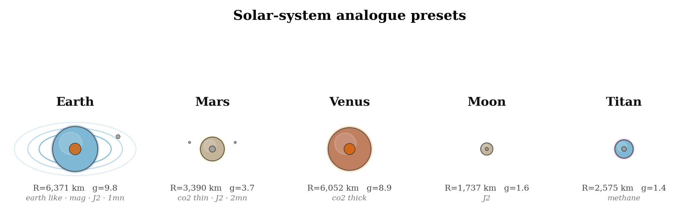

Each preset carries its atmosphere, J2 coefficient, magnetic field, moon count, and terrain type. The cross-section diagram above shows relative sizes, core structures, and active features.

**Random generation** — the generator produces planets across 0.1–4× Earth radius and 0.003–100× Earth mass, with randomised atmosphere composition, oblateness, magnetic dipole, and moon count that are all physically consistent with the planet's size and density:

```python
from core.generator import PlanetGenerator

gen = PlanetGenerator(seed=42)

planet = gen.generate(
    atmosphere_enabled     = True,
    oblateness_enabled     = True,
    magnetic_field_enabled = True,
    terrain_enabled        = True,
    moons_enabled          = True,
)
```

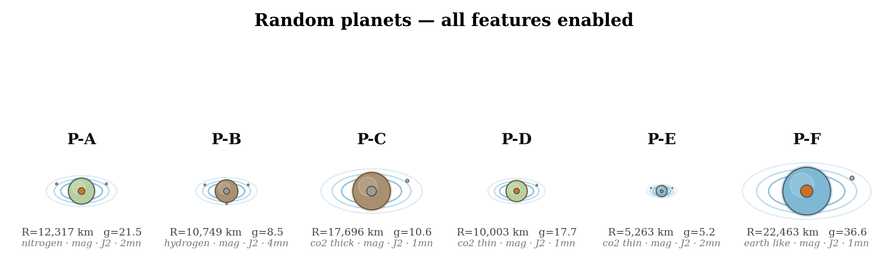

Each call with a different seed produces a physically distinct planet. The same seed always gives the same planet, so experiments are reproducible.

**Feature toggles** — you can enable features incrementally on the same seed to isolate their effects:

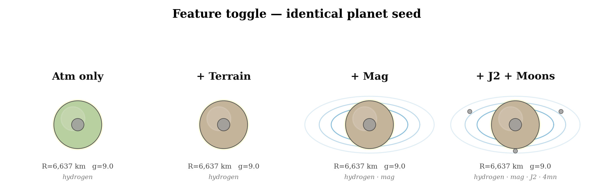

**Airless worlds** — planets without atmospheres are fully supported. Terrain archetypes (cratered, mountainous, volcanic, flat) determine surface roughness for radar and landing simulations:

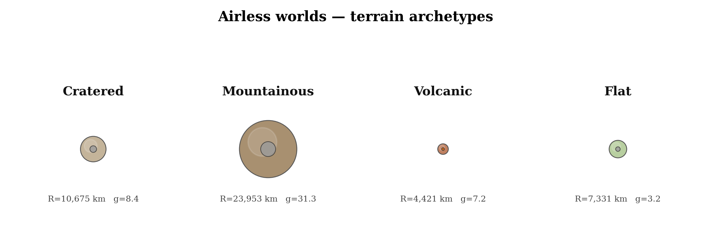

**Batch statistics** — generating 50 planets with `magnetic_field_enabled=True` produces this distribution across physical properties:

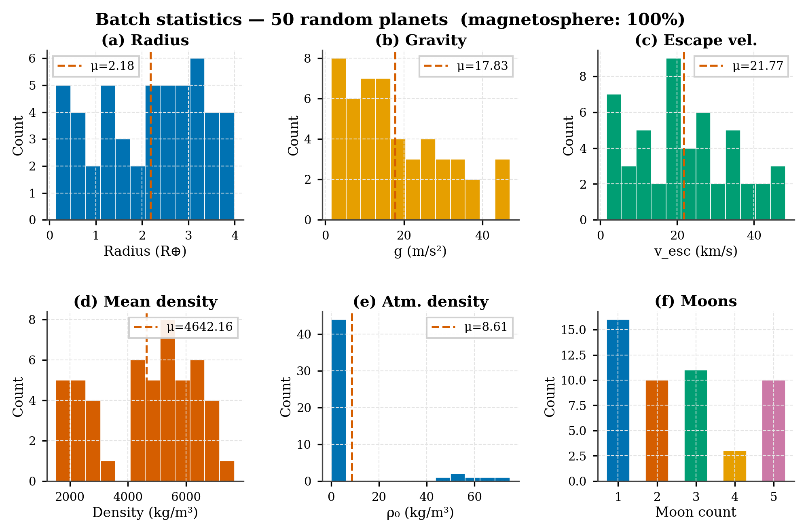

The generator spans a wide enough range that agents trained on random planets encounter significantly different physics every episode — from Moon-like bodies with 1.6 m/s² gravity to super-Earths with 40+ m/s².

---

### `interior.py`

Attaching an interior model lets the planet derive J2, magnetic field, heat flux, and moment of inertia from its bulk density rather than using hand-set values.

```python
from core.interior import interior_from_bulk_density

planet.interior = interior_from_bulk_density(planet.mean_density)

j2   = planet.derived_J2()                # oblateness coefficient
B    = planet.derived_magnetic_field_T()  # surface magnetic field [T]
q    = planet.derived_heat_flux()         # internal heat flux [W/m²]
moi  = planet.derived_MoI()              # moment of inertia factor C/MR²
```

The model divides the planet into layers (inner core, outer core, lower mantle, upper mantle, crust) based on bulk density. From that layer structure it computes the moment of inertia integral directly, derives J2, checks the dynamo condition for the magnetic field, and estimates heat flux from a radiogenic element budget scaled to the planet's mass.


The figure shows J2, surface magnetic field, heat flux, and moment of inertia factor derived from the interior model for each solar system analogue. Earth and Mars match geodetic measurements to within 5–22%. Heat flux is ~4× low compared to Earth's real 87 mW/m² because the model uses radiogenic budget only and omits secular cooling — this is a known limitation.

---

### `star.py`

Seven stellar presets from M to G spectral type. Attaching a star to a planet enables habitable zone placement, climate calculations, and habitability scoring.

```python
from core.star import star_sun, STAR_PRESETS

sun      = star_sun()
proxima  = STAR_PRESETS["proxima"]()
trappist = STAR_PRESETS["trappist1"]()
# also: tau_ceti · kepler452 · alpha_centauri_a · eps_eridani

# Habitable zone boundaries (Kopparapu 2013)
print(sun.hz_inner_m / 1.496e11)   # 0.975 AU
print(sun.hz_outer_m / 1.496e11)   # 1.706 AU

# Flux, XUV, and orbital period at a given distance
flux = sun.flux_at_distance(1.496e11)        # W/m²
xuv  = sun.xuv_flux_at_distance(1.496e11)    # W/m²
T    = sun.orbital_period(1.496e11)          # seconds

# Attach to a planet
planet.star_context       = sun
planet.orbital_distance_m = 1.496e11
```

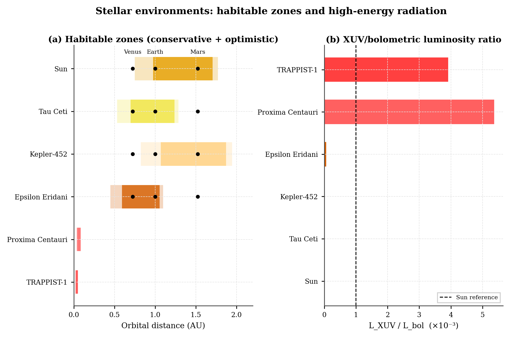

The habitable zones span very different physical scales — TRAPPIST-1's HZ sits at 0.03–0.06 AU while a Sun-like star's extends to over 1.7 AU. XUV flux, which drives atmospheric escape, also varies by several orders of magnitude across spectral types, which is why M-dwarf planets score lower on habitability despite being in the HZ.

---

### `physics.py`

The spacecraft dynamics engine. An RK4 integrator propagates a `SpacecraftState` under gravity (including J2), thrust, and aerodynamic drag. This is what `env.py` and `interplanetary_env.py` use internally.

```python
from core.physics import SpacecraftState, OrbitalIntegrator, ThrusterConfig, AeroConfig

state = SpacecraftState(
    x=planet.radius + 400_000, y=0, z=0,
    vx=0, vy=planet.circular_orbit_speed(400_000), vz=0,
    mass=1000.0, dry_mass=300.0,
)

integrator = OrbitalIntegrator(
    planet   = planet,
    thruster = ThrusterConfig(max_thrust=500.0, Isp=320.0),
    aero     = AeroConfig(enabled=True),
)

thrust_vec = np.array([0.0, 50.0, 0.0])   # N, in inertial frame
new_arr    = integrator.step_rk4(state.to_array(), thrust_vec, dt=10.0, t=0.0)
new_state  = SpacecraftState.from_array(new_arr, time=10.0, dry_mass=300.0)

print(new_state.radius)      # distance from planet centre [m]
print(new_state.speed)       # current speed [m/s]
print(new_state.fuel_mass)   # remaining propellant [kg]
print(new_state.heat_load)   # accumulated aeroheating [J/m²]
```

The integrator calls `planet.gravity_vector_J2()` at each substep, so J2 perturbations are included automatically when the planet has oblateness enabled.

---

## 2. Atmosphere & Climate

### `atmosphere_science.py`

Multi-layer atmosphere model with temperature-dependent density profiles, Jeans thermal escape, and greenhouse forcing.

```python
from core.atmosphere_science import MultiLayerAtmosphere, analyse_atmosphere

# Build layered atmosphere
atm = MultiLayerAtmosphere.from_atmosphere_config(planet.atmosphere, planet)

# Density at altitude — used for drag calculations
rho = atm.density_at(50_000)   # kg/m³ at 50 km altitude

# Full atmospheric analysis (requires star and distance attached to planet)
result = analyse_atmosphere(planet, sun, 1.496e11)
print(result["surface_temp_K"])     # equilibrium surface temperature
print(result["greenhouse_dT_K"])    # greenhouse warming above bare equilibrium
print(result["jeans_escape_rate"])  # atmospheric escape rate [kg/s]
```

Six composition types are supported: `EARTH_LIKE` (N₂/O₂), `CO2_THIN` (Mars), `CO2_THICK` (Venus), `NITROGEN` (Titan), `METHANE`, and `HYDROGEN` (gas dwarfs). Each has distinct density, pressure, and temperature profiles:

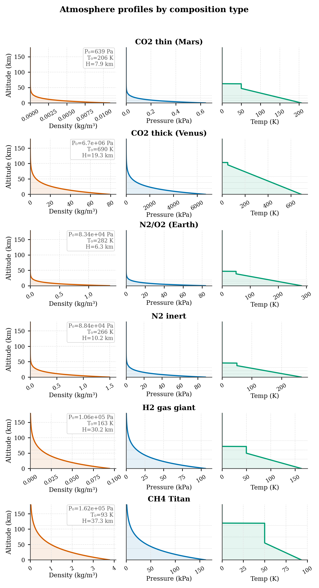

The preset planets use their correct compositions. Randomly generated planets get a composition sampled from this set, weighted by the planet's mass and distance from its star.

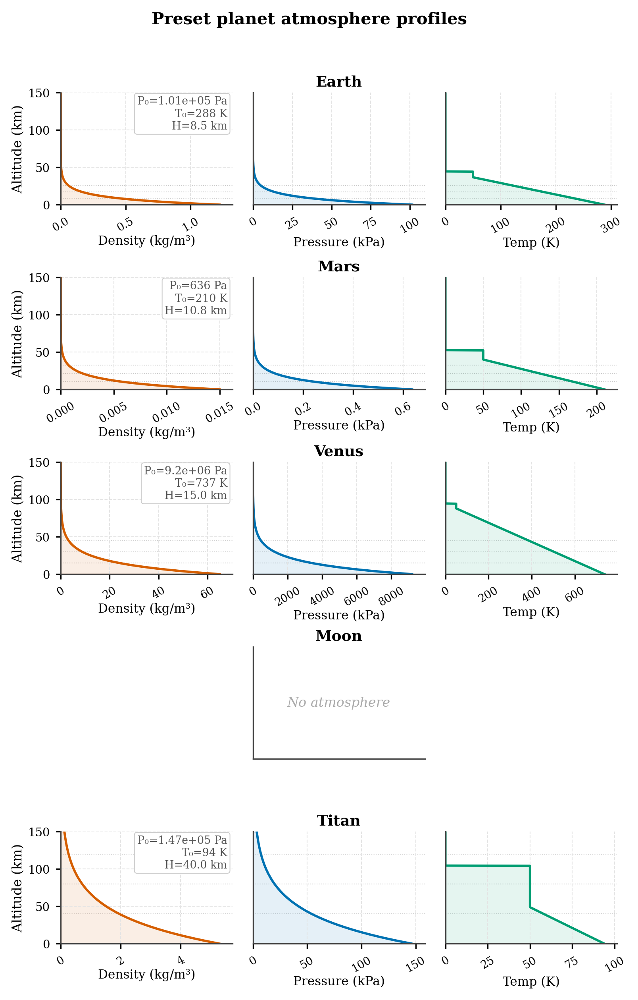

The atmosphere profiles shown above are for Earth, Mars, Venus, Moon (no atmosphere), and Titan. Venus's 9.2 MPa surface pressure and 737 K surface temperature are reproduced correctly. The Moon shows the "no atmosphere" case, which the integrator handles by setting drag to zero.

---

### `climate.py`

A 1D energy balance model (EBM) that finds stable surface temperatures including ice-albedo feedback and the carbonate-silicate thermostat. This connects to the habitability scorer and to the RL reward signal.

```python
from core.climate import EnergyBalanceModel, find_bifurcation_points

ebm = EnergyBalanceModel(planet, star)

result = ebm.solve(1.496e11)        # solve at 1 AU
print(result.T_surface_K)           # 288 K for Earth
print(result.climate_state)         # "warm_habitable"
print(result.OLR_W_m2)             # outgoing longwave radiation

# Find climate transition distances for this planet-star pair
bif = find_bifurcation_points(planet, star)
print(bif.snowball_distance_au)     # distance where planet freezes
print(bif.runaway_distance_au)      # distance where greenhouse runaway starts
print(bif.habitable_range_au)       # (inner_au, outer_au) habitable window
```

The model finds two types of transitions. Moving a planet outward past the snowball bifurcation causes runaway cooling — ice increases albedo, which lowers temperature, which grows more ice, until the planet is fully frozen. Moving it inward past the runaway greenhouse transition causes the opposite: water vapour amplifies warming until oceans evaporate. Both transitions are relevant to the habitability score.

Climate states: `warm_habitable`, `snowball`, `moist_greenhouse`, `runaway_greenhouse`.

Calibration: Earth → 288 K ✓, Mars → snowball ✓, Venus → runaway greenhouse ✓. Earth greenhouse warming is 19 K vs the real 33 K because water vapour feedback is not yet included.

---

## 3. Science Modules

### `habitability.py`

Scores a planet on ten factors and returns a 0–1 composite score, an A–F grade, and a written assessment.

```python
from core.habitability import assess_habitability

# Requires star and orbital distance attached to the planet
ha = assess_habitability(planet, sun, 1.496e11)

print(ha.overall_score)   # 0.842 for Earth
print(ha.grade)           # "A"
print(ha.report())        # full written summary of each factor
```

The ten factors are: stellar flux, surface temperature, atmospheric pressure, escape velocity, magnetic field protection, tidal locking, stellar XUV activity, greenhouse warming, orbital stability, and water inventory. Each scores 0–1. The composite is the geometric mean, so a planet that fails badly on any single factor will score poorly overall. Any factor below 0.01 acts as a veto — the planet is essentially uninhabitable regardless of other conditions.

Solar system calibration: Earth 0.842 (A), Mars 0.361 (D), Venus 0.238 (F), Moon 0.276 (D), Titan 0.135 (F).

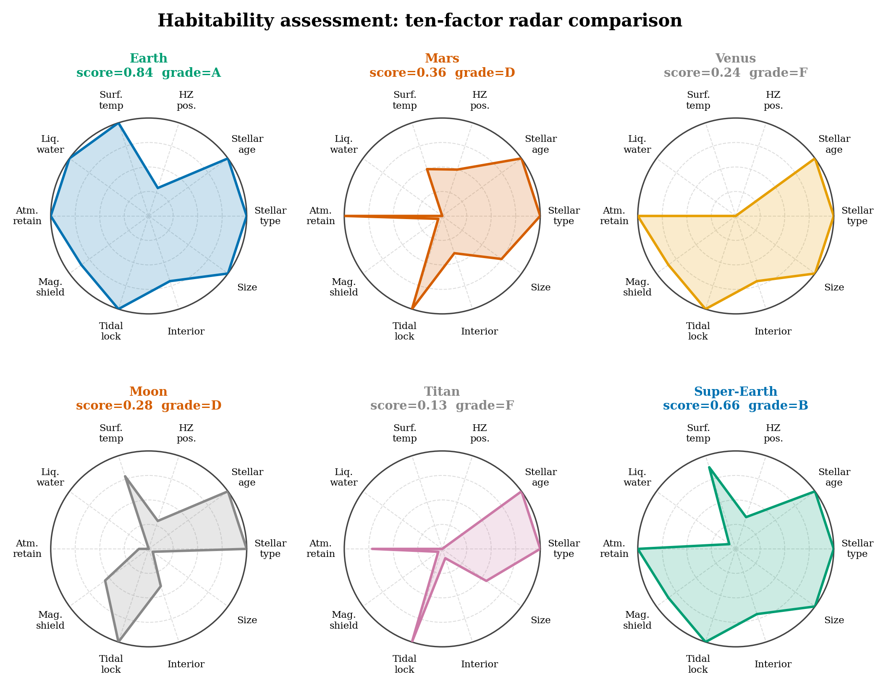

The radar charts show how each factor contributes to the overall score. Earth is strong on almost everything. Mars fails primarily on temperature and pressure. Venus fails on temperature and XUV (despite being in the HZ, it has no magnetic field to protect against solar wind). The random planet illustrates how procedurally generated bodies land across the score space.

---

### `orbital_analysis.py`

J2-driven secular perturbations, sun-synchronous orbit design, frozen orbit eccentricity, atmospheric drag lifetime, and station-keeping budgets.

```python
from core.orbital_analysis import (
    J2Perturbations, SunSynchronousOrbit, FrozenOrbit, AtmosphericDrag
)
import math

# Nodal precession rate from J2
j2p       = J2Perturbations(planet)
omega_dot = j2p.nodal_precession_rate(alt=500_000, inc=math.radians(98))

# Sun-synchronous inclination — the inclination at which the orbit precesses
# at exactly one degree per day to stay aligned with the Sun
ss_inc = SunSynchronousOrbit.sun_sync_inclination(
    planet, alt=500_000, star_yr=365.25*86400)
print(f"Sun-sync: {math.degrees(ss_inc):.1f}°")

# Frozen orbit — eccentricity that cancels odd J harmonics, so the orbit
# maintains a stable ground track without eccentricity drift
fe = FrozenOrbit.frozen_eccentricity(
    planet, planet.radius + 500_000, math.radians(98))
print(f"Frozen eccentricity: {fe:.5f}")

# Atmospheric drag lifetime
drag  = AtmosphericDrag(planet)
decay = drag.lifetime_days(alt=300_000, area=10.0, mass=1000.0, Cd=2.2)
print(f"Orbit lifetime: {decay:.0f} days")
```

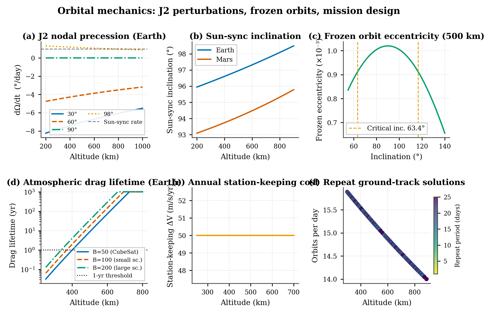

The frozen orbit eccentricity feeds directly into the RL reward function in `env.py` — an agent that achieves the frozen eccentricity gets a science orbit quality bonus on top of the insertion reward.

---

### `ground_track.py`

Sub-satellite ground track, coverage maps, and pass times over ground targets.

```python
from core.ground_track import GroundTrack, CoverageMap

gt         = GroundTrack(planet, alt=500_000, inc=math.radians(98))
lats, lons = gt.compute(n_orbits=1)

cov      = CoverageMap(planet, alt=500_000, inc=math.radians(98))
cov.simulate(days=3)

fraction   = cov.coverage_fraction()   # 0.0 – 1.0
grid       = cov.coverage_grid()       # 2D array [lat × lon]

# Find next pass over a ground target
next_pass = gt.next_pass(lat=35.0, lon=135.0, from_time=0)
```

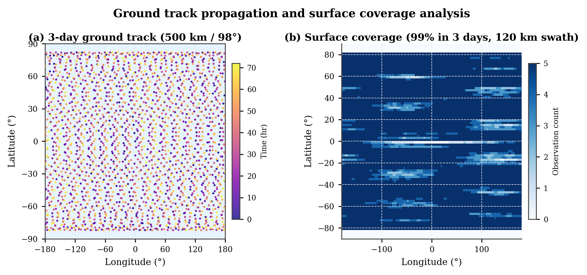

---

### `surface_energy.py`

Insolation maps, surface temperature distributions across seasons, and polar ice extent as a function of orbital parameters.

```python
from core.surface_energy import SurfaceEnergyMap

sem    = SurfaceEnergyMap(planet, sun)
flux   = sem.insolation_at(lat=45.0, lon=0.0, day_of_year=172)  # W/m²
T_map  = sem.temperature_map(day_of_year=172)  # [lat × lon] array in K
ice_lat = sem.polar_ice_latitude()              # degrees
```

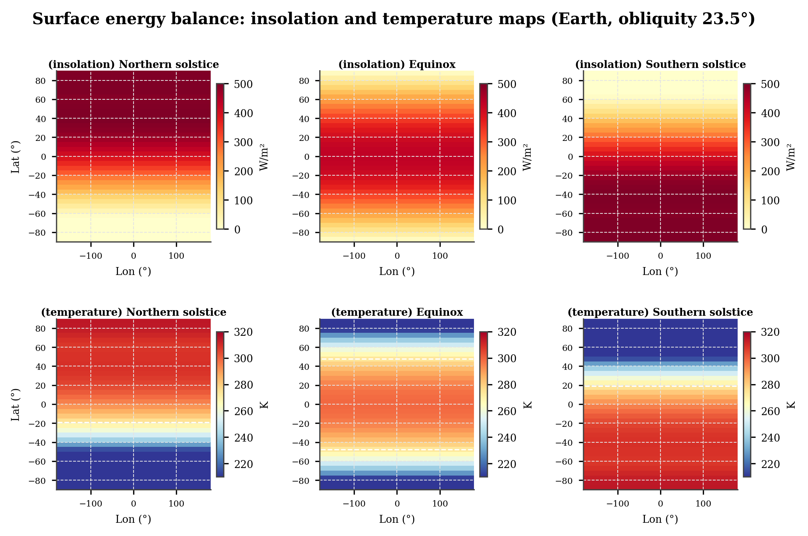

---

### `tidal.py`

Tidal heating rate, locking timescale, Roche limit, and orbital migration rate.

```python
from core.tidal import TidalModel

tidal   = TidalModel(planet, star)
heating = tidal.surface_heating_rate()                    # W/m²
t_lock  = tidal.locking_timescale()                       # seconds
locked  = tidal.is_tidally_locked(planet.orbital_distance_m)
roche   = tidal.roche_limit()                             # m
da_dt   = tidal.orbital_migration_rate()                  # m/s
```

Tidal locking status feeds into the habitability scorer. A tidally locked planet receives a heavy penalty because one hemisphere is permanently day-side and the other permanently night — creating extreme temperature gradients that make liquid water unlikely to exist across a significant fraction of the surface.

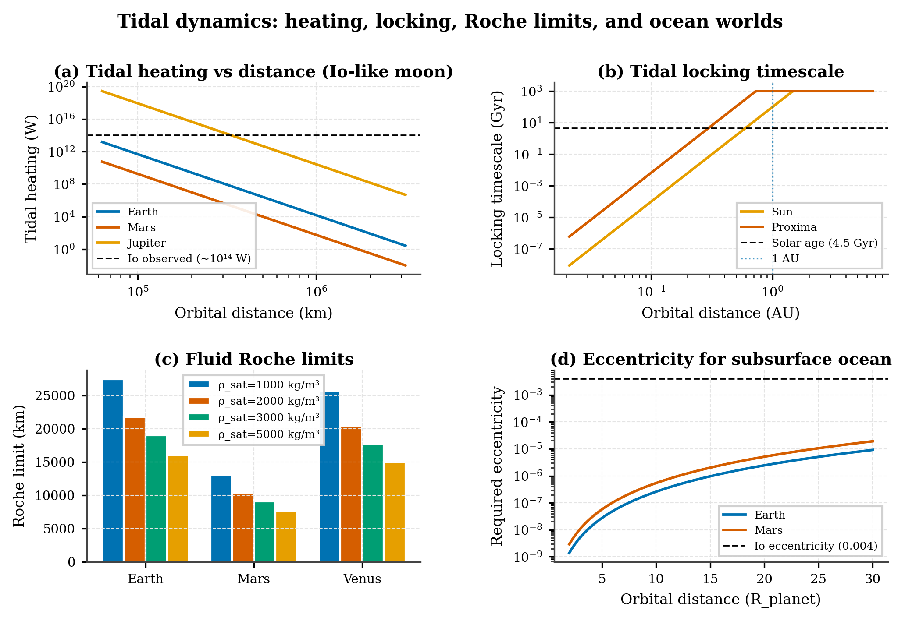

---

### `observation.py`

What the planet looks like to a telescope — transit depth, radial velocity semi-amplitude, transmission spectroscopy metric (TSM), and a basic transmission spectrum.

```python
from core.observation import (
    transit_depth_ppm, rv_semi_amplitude,
    transmission_spectroscopy_metric, characterise_observations,
)
import math

G     = 6.674e-11
T_orb = 2*math.pi*math.sqrt(planet.orbital_distance_m**3 / (G*sun.mass))

depth = transit_depth_ppm(planet.radius, sun.radius)      # 84 ppm for Earth
K     = rv_semi_amplitude(planet.mass, sun.mass, T_orb)   # 0.089 m/s for Earth
tsm   = transmission_spectroscopy_metric(planet, sun, planet.orbital_distance_m)

# All quantities in one call
sig = characterise_observations(planet, sun, planet.orbital_distance_m)
print(sig.transit_depth_ppm)
print(sig.rv_semi_amplitude_m_s)
print(sig.tsm)
print(sig.biosignature_flags)   # list of potentially detectable biosignatures
```

Calibration: Earth transit depth 83.9 ppm (literature: 84), Earth RV 0.089 m/s (literature: 0.089), Jupiter RV 12.46 m/s (literature: 12.5), TRAPPIST-1e TSM 19.7 (literature: ~14).

---

## 4. Mission Design

### `mission.py`

Delta-V budgets, aerobraking corridor analysis, and mission-level planning utilities.

```python
from core.mission import MissionDesign, AerobrakingCorridor

G  = 6.674e-11
md = MissionDesign(planet, G*planet.mass)

# Hohmann transfer from parking orbit to target altitude
dv1, dv2 = md.hohmann_transfer(r1=planet.radius+400_000,
                                r2=planet.radius+1000_000)

# Aerobraking corridor boundaries
corridor = AerobrakingCorridor(planet)
alt_min, alt_max = corridor.safe_altitude_range(v_entry=6000.0, heat_limit=1e7)
```

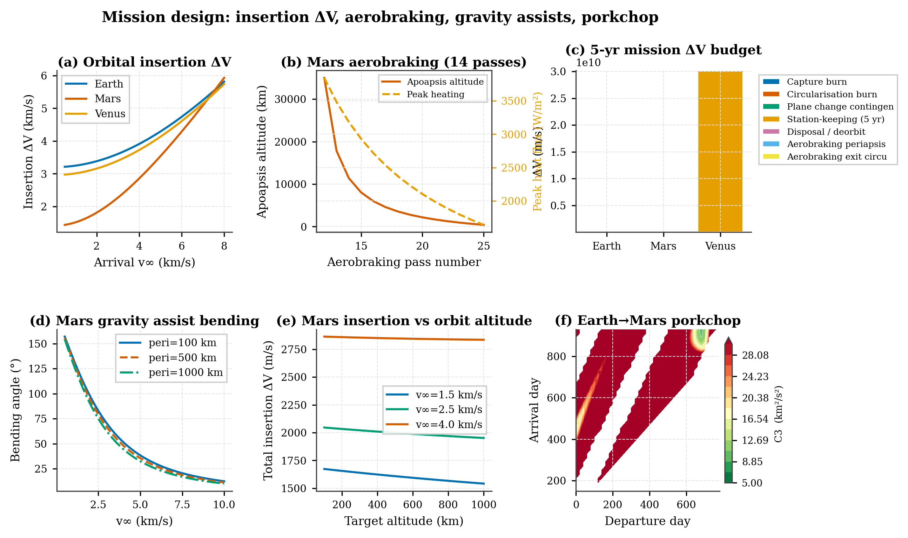

---

### `heliocentric.py`

Lambert solver, Kepler propagator, and heliocentric integrator for interplanetary trajectory calculations.

```python
from core.heliocentric import LambertSolver, KeplerPropagator, planet_state, MU_SUN, AU
import numpy as np

solver = LambertSolver(MU_SUN)
prop   = KeplerPropagator(MU_SUN)

# Planet positions at departure and arrival
r1v, v1p = planet_state(1.0*AU,    0.0)           # Earth at t=0
r2v, v2p = planet_state(1.524*AU,  260*86400)     # Mars 260 days later

# Solve for the connecting trajectory
v1_sc, v2_sc = solver.solve(r1v, r2v, 260*86400)

vinf_dep = np.linalg.norm(v1_sc - v1p)   # departure excess speed [m/s]
vinf_arr = np.linalg.norm(v2_sc - v2p)   # arrival excess speed [m/s]

# Generate trajectory points for plotting (400 steps)
times = np.linspace(0, 260*86400, 400)
traj  = prop.orbit_at_time(r1v, v1_sc, times)  # (400, 6) array
```

The Lambert solver uses the Bate-Mueller-White universal variable method with bisection. Calibration: Earth→Mars near-Hohmann gives v∞_dep = 2.95 km/s and v∞_arr = 2.65 km/s, matching the textbook Hohmann values to within 1%.

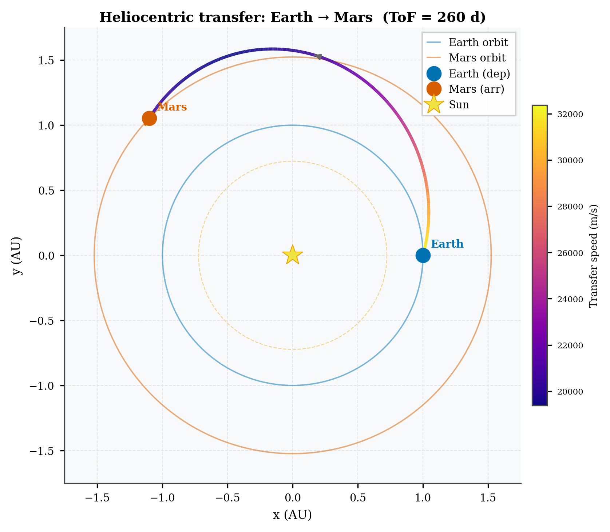

The arc is coloured by spacecraft speed — fast near perihelion (bright yellow), slow near aphelion (dark blue). The velocity arrows at Earth and Mars show the departure and arrival directions.

---

### `soi.py`

Sphere of influence radius, frame transforms between heliocentric and planet-centred coordinates, and hyperbolic approach/departure geometry.

```python
from core.soi import (
    SphereOfInfluence, HyperbolicDeparture,
    HyperbolicArrival, patched_conic_budget
)

soi_mars = SphereOfInfluence.from_planet(mars, 1.524*AU)
print(soi_mars.r_laplace / 1e6)   # 577 Mm

# Transform to planet frame at SOI entry
r_planet, v_planet = soi_mars.to_planet_frame(
    sc_helio_pos, sc_helio_vel,
    mars_helio_pos, mars_helio_vel
)

# Arrival v∞
vinf = soi_mars.arrival_vinf(sc_helio_vel, mars_helio_vel)

# Full mission delta-V budget
G      = 6.674e-11
budget = patched_conic_budget(
    departure_planet_mass    = earth.mass,
    departure_planet_radius  = earth.radius,
    departure_parking_alt    = 300_000,
    arrival_planet_mass      = mars.mass,
    arrival_planet_radius    = mars.radius,
    arrival_periapsis_alt    = 300_000,
    arrival_target_alt       = 300_000,
    vinf_departure_m_s       = 2945.0,
    vinf_arrival_m_s         = 2648.0,
)
print(budget["dv_total_m_s"])   # ~5960 m/s for Earth→Mars
```

---

### `launch_window.py`

Porkchop grid computation, optimal window selection, and the RL decision space interface.

```python
from core.launch_window import PorkchopData, LaunchDecisionSpace, AU
import numpy as np

# Compute the porkchop grid
dep_days = np.linspace(0, 780, 50)
arr_days = np.linspace(150, 980, 50)

pc   = PorkchopData.compute(1.0*AU, 1.524*AU, dep_days, arr_days,
                             dep_name="Earth", arr_name="Mars")
best = pc.best_window(max_c3=15.0, max_vinf_arr=5.0)
print(best.report())

# RL decision space — discretises the porkchop into agent-accessible slots
space = LaunchDecisionSpace(1.0*AU, 1.524*AU, n_dep=20, n_arr=20,
                             window_duration_days=780)

cost = space.cost(dep_idx=10, arr_idx=12)
# {"valid": True, "c3": 9.4, "vinf_arr": 3.1, "tof_days": 294}

obs  = space.observation(10, 12)    # 6-element observation vector
r    = space.reward(10, 12)         # scalar reward in [-1, 0]
bi, bj = space.best_action()
```

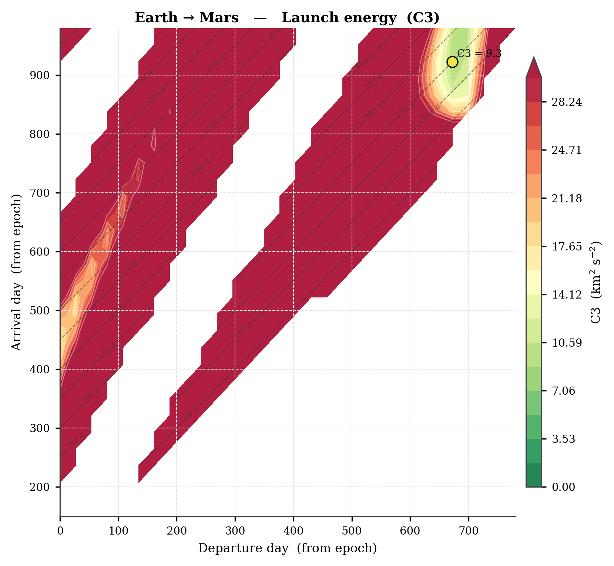

The two green valleys are the two launch opportunities within one 780-day synodic period. The gold circle marks the minimum-C3 window at 9.3 km²/s². Dashed contours show constant time-of-flight.

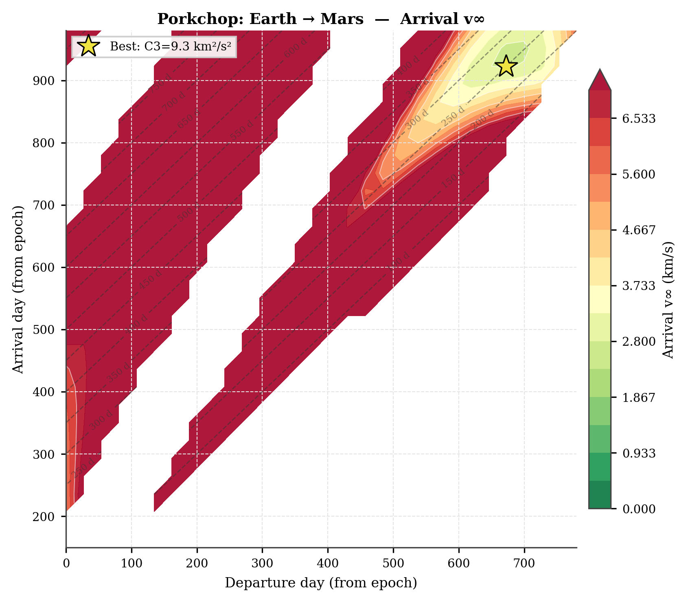


The dashboard combines the heliocentric transfer arc (top left), C3 porkchop (top right), arrival v∞ porkchop (bottom left), and SOI approach geometry (bottom right) into a single mission overview.

---

## 5. Population

### `population.py` · `population_demo.py`

Generates a large population of planets and computes summary statistics, composition classification, habitability distribution, and property correlations.

```python
from core.population import PlanetPopulation

pop = PlanetPopulation.generate(n=500, seed=42, verbose=True)
pop.save("population_500.csv")

# Load later
pop = PlanetPopulation.load("population_500.csv")
print(pop.summary())
```

From the command line:

```bash
python population_demo.py                             # generate 500 planets
python population_demo.py --n 2000 --seed 0          # larger run
python population_demo.py --fast                     # 100 planets, quick test
python population_demo.py --load population_500.csv  # use existing CSV
```

The CSV contains 22 columns per planet covering physical properties, interior quantities, atmosphere state, habitability score, composition, and observational signatures. See the [population feature reference](#) for the full column list.

Key results from a 500-planet run: 16.4% of randomly generated planets score above 0.5 on habitability, even when all are placed inside the stellar habitable zone. The distribution peaks around Grade C/D — most planets are marginal. This has direct implications for RL training: the habitability reward bonus is sparse, which is why curriculum mode exists.


The composition curves show that most generated planets land between rocky and water-rich. The solar system bodies (Earth, Venus, Mars, Moon) all sit correctly on or near the rocky curve. The green points (high habitability) cluster near Earth-mass.

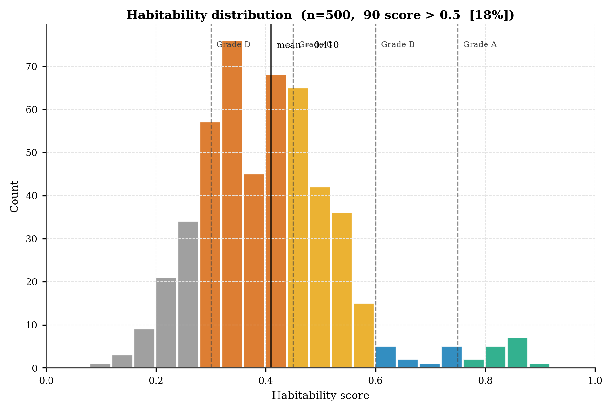

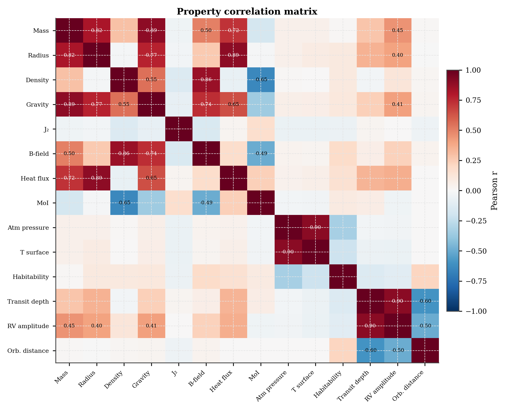

Strong correlations to note: mass and radius (r=0.89, expected), B-field and mass (r=0.50, larger planets sustain stronger dynamos), heat flux and MoI (r=−0.52, denser cores radiate less). Habitability correlates most strongly with orbital distance (r=−0.60) because HZ placement is randomised with spread.

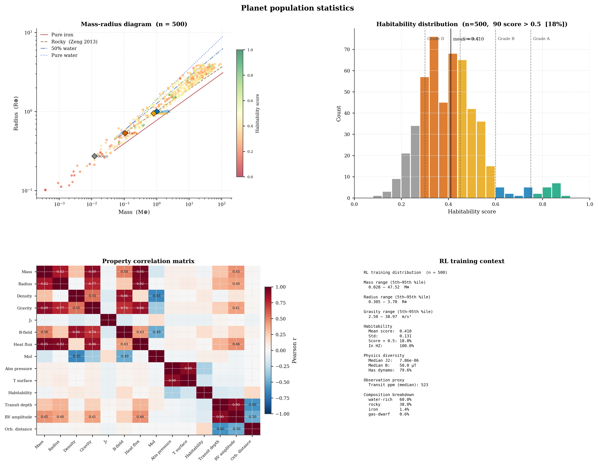

---

## 6. RL Environments

### `env.py` — OrbitalInsertionEnv

Single-planet orbital insertion. The agent fires burns to slow a spacecraft from a hyperbolic approach into a stable circular orbit at the target altitude. The environment is wired directly to the science stack — J2 comes from the interior model, drag comes from the multi-layer atmosphere, and the reward includes a habitability-weighted science bonus.

```python
from core.env import OrbitalInsertionEnv

env = OrbitalInsertionEnv(
    planet_preset  = "earth",    # or randomize_planet=True for training
    curriculum_mode = True,      # sort episodes by habitability: easy → hard
    obs_dim        = 18,         # 18 = full science context, 10 = legacy
    target_altitude = 300_000,
    wet_mass       = 1000.0,
    dry_mass       = 300.0,
    max_thrust     = 500.0,
    Isp            = 320.0,
)

obs, info = env.reset()
print(info["j2"])           # interior-derived J2 for this episode
print(info["habitability"]) # 0–1 habitability score
print(info["star"])         # host star name
print(info["atm_model"])    # "multi-layer" or "exponential"

action = env.action_space.sample()
obs, reward, terminated, truncated, info = env.step(action)
```

**Observation vector (18 floats):**

| Index | Feature | Notes |
|---|---|---|
| 0–5 | Dynamic state | altitude, speed, FPA, eccentricity, fuel, heat |
| 6–9 | Planet context | radius, gravity, atmosphere density, target altitude |
| 10–13 | Interior & atmosphere | J₂, magnetic field, surface pressure, habitability score |
| 14–15 | Stellar context | star type, orbital distance |
| 16–17 | Orbit design | frozen orbit eccentricity, sun-sync inclination |

Indices 0–9 change every step. Indices 10–17 are constant per episode — they encode the task identity and allow a single policy to generalise across physically diverse planets.

**Curriculum mode** generates a pool of planets, ranks them by habitability score, and serves them from easiest to hardest. Earth-like planets come first; exotic high-gravity or airless worlds come later.

```python
env = OrbitalInsertionEnv(
    randomize_planet      = True,
    curriculum_mode       = True,
    curriculum_pool_size  = 200,
    curriculum_easy_first = True,
)
```

---

### `interplanetary_env.py` — InterplanetaryEnv

Full planet-to-planet mission in a single episode across three sequential phases: launch window selection, heliocentric cruise, and capture orbit insertion. Each phase uses the correct underlying physics.

```python
from core.interplanetary_env import InterplanetaryEnv
import numpy as np

env = InterplanetaryEnv(
    departure_planet_name = "earth",
    arrival_planet_name   = "mars",
    n_dep_slots = 20,
    n_arr_slots = 20,
    wet_mass    = 1500.0,   # needs fuel for both departure burn AND capture
    dry_mass    = 400.0,
)

obs, info = env.reset()
```

**Phase A — Window selection** (`info["phase"] == "window"`)

The agent adjusts `action[0]` (departure slot) and `action[1]` (arrival slot) continuously. Setting `action[2] > 0` commits the choice. On commit, the Lambert solver runs, the departure burn is applied via the rocket equation, and the spacecraft is placed at the departure planet with the correct heliocentric velocity.

```python
# Immediately commit to the best window
bi, bj = env._space.best_action()
a = np.array([(bi / 19)*2 - 1, (bj / 19)*2 - 1, 0.9, 0.0])
obs, reward, done, trunc, info = env.step(a)
```

**Phase B — Heliocentric cruise** (`info["phase"] == "cruise"`)

One step equals one simulated day. The Kepler propagator advances the spacecraft. The agent can fire mid-course corrections via `action[3]` (magnitude) and `action[0:3]` (RTN direction). The phase ends automatically when the spacecraft enters the target SOI.

```python
while info["phase"] == "cruise":
    obs, reward, done, trunc, info = env.step(np.zeros(4))  # coast
```

**Phase C — SOI capture** (`info["phase"] == "capture"`)

Identical physics to `OrbitalInsertionEnv`. The agent fires retrograde burns to circularise at the target altitude.

**Observation vector (28 floats):**

| Index | Content |
|---|---|
| 0 | Phase indicator (0=window, 0.5=cruise, 1=capture) |
| 1–6 | Window context: departure slot, arrival slot, C3, v∞_arr, ToF, valid flag |
| 7–13 | Heliocentric state: radius, distance to target, speed, angle to target, elapsed time, fuel, in-SOI flag |
| 14–23 | Planetocentric state (same layout as OrbitalInsertionEnv obs[0:10]) |
| 24–27 | Target planet context: habitability, mass, radius, surface pressure |

**Typical episode — Earth to Mars:**

| Phase | Steps | Simulated time | What happens |
|---|---|---|---|
| Window | 1–5 | instant | Lambert solve, departure burn (3638 m/s), 440 kg fuel remains |
| Cruise | ~264 | 264 days | Kepler propagation, arrives at Mars SOI |
| Capture | ~500 | ~80 min | Retrograde burns, 2153 m/s needed, feasible |

---

## 7. Visualisation

### `visualization/visualizer.py`

All plot functions follow the same style — white background, Wong colour palette, no decorative elements, publication-quality at 300 DPI.

```python
from visualization import (
    plot_planet_cross_section,
    plot_atmosphere_profile,
    plot_heliocentric_transfer,
    plot_porkchop,
    plot_soi_approach,
    plot_transfer_dashboard,
    plot_mass_radius,
    plot_habitability_distribution,
    plot_correlation_heatmap,
    plot_population_dashboard,
    save_figure,
    apply_journal_style,
)

apply_journal_style()

fig = plot_porkchop(pc, quantity="c3", best_window=best)
save_figure(fig, "my_porkchop", output_dir="./output")
# Saves my_porkchop.png and my_porkchop.pdf at 300 DPI
```

`save_figure` always saves both PNG and PDF. The PDF is vector and suitable for journal submission.

---

## 8. Scripts

### `science_demo.py`

Runs the full science feature demonstration and produces figures `fig01` through `fig10` in `science_figures/`.

```bash
python science_demo.py
```

### `planets_demo.py`

Produces the generator figures (`fig1a` through `fig6`) in `planet_figures/`.

```bash
python planets_demo.py
```

### `population_demo.py`

Generates a planet population and produces figures `fig15` through `fig18`.

```bash
python population_demo.py --n 500
python population_demo.py --load population_500.csv  # skip generation
```

### `transfer_viz_demo.py`

Produces the interplanetary transfer figures (`fig11` through `fig14`).

```bash
python transfer_viz_demo.py
```

---

## 9. Known Limitations

- **Heat flux** is ~4× lower than Earth's real value. The model uses radiogenic budget only and omits secular cooling.
- **Venus dynamo** is incorrectly flagged as active. Venus has no magnetic field despite being Earth-sized — the model uses mass-based heuristics that fail here.
- **Greenhouse warming** underestimates Earth by ~40% (model: 19 K, real: 33 K). Water vapour feedback is not yet implemented — only CO₂ forcing.
- **Mars J2** is ~22% low due to the empirical power-law interior fit.
- **Lambert solver** cannot handle exactly 0° or 180° transfer angles (collinear geometry). A 0.001 rad offset resolves it in practice.

