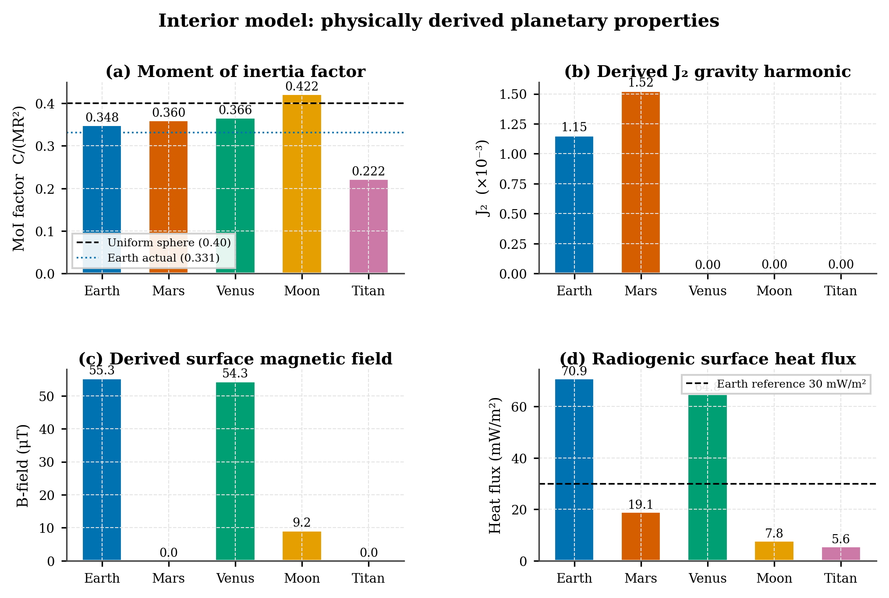
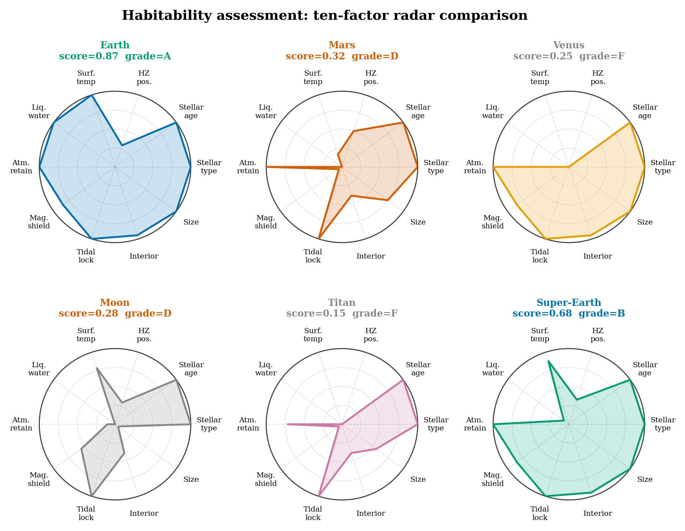
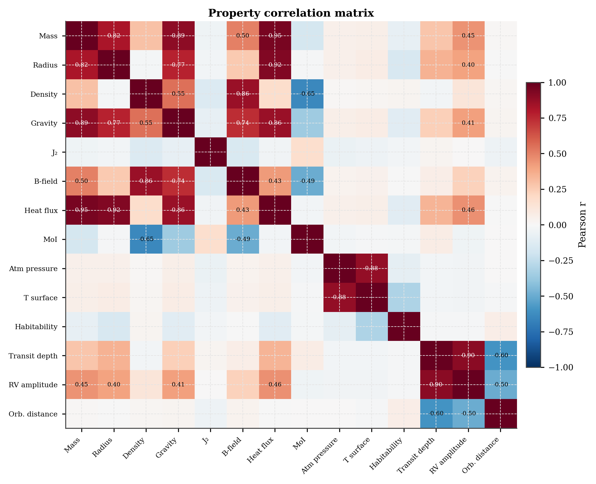
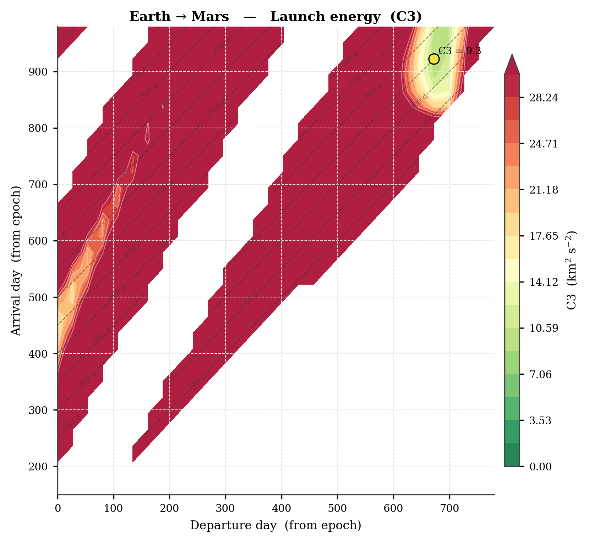
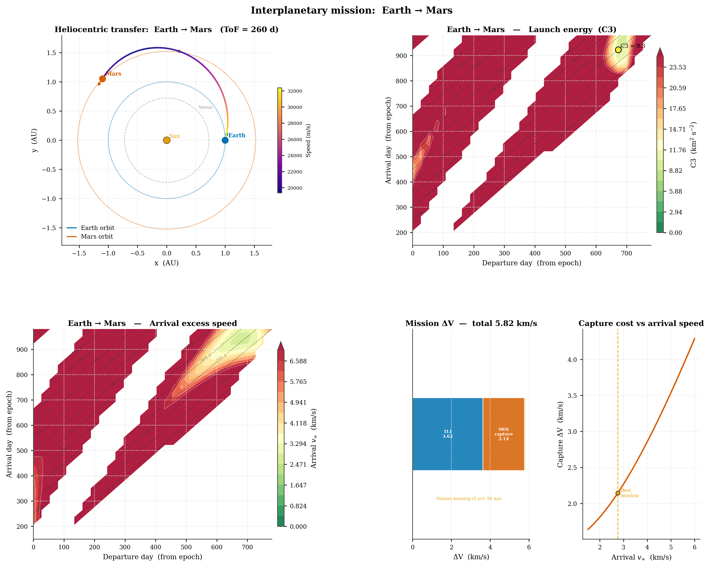

# Planet-RL Astrophysics / Planetary Science Tutorial

Planet-RL isn’t just an RL benchmark: you can use the underlying simulation stack *as an astrophysics / planetary‑science toolkit* for:

- procedural planet generation (presets + random)
- interior structure (MoI, derived \(J_2\), heat flux, dynamo / magnetic field proxies)
- atmospheric structure (multi-layer profiles, scale height, Jeans escape estimates)
- simple climate/energy balance hooks
- habitability scoring (multi-factor)
- orbital mechanics utilities (frozen orbits, sun-synchronous, ground tracks)
- population studies (mass–radius, correlations, habitability distributions)
- publication-style plotting helpers

This tutorial focuses on the *science side* (no RL required).

> Run commands from the repository root (`Planet-RL/`) inside an activated venv.

---

## 0) Install

```bash
python -m venv .venv
source .venv/bin/activate
pip install -e .
```

If you plan to run the plotting-heavy demos, make sure `matplotlib` is installed (it is part of the base dependencies).

> Note: the RL environments live in `exorl/core/env.py`, `exorl/core/interplanetary_env.py`, and `exorl/core/science_ops_env.py`, but this doc focuses on the astrophysics/planet-science modules.

---

## 1) Quick tour: planet generation + visualization

Run:

```bash
python examples/planets_demo.py
```

What it does (high level):

- draws cross-sections for the **5 preset** solar-system analogues (`earth`, `mars`, `venus`, `moon`, `titan`)
- generates random planets with toggled features
- produces “atmosphere zoo” plots across atmosphere compositions

Outputs:

- figures under `figures/planet_figures/` (e.g. preset cross-sections and atmosphere profiles)

Example outputs:


---

## 2) Full science feature demo (interior + atmospheres + habitability + orbits)

Run:

```bash
python examples/science_demo.py
```

This is the most comprehensive “astrophysics side” walkthrough in the repo. It produces a sequence of figures demonstrating:

- interior-derived quantities (MoI, \(J_2\), magnetic field proxy, heat flux)
- habitable zone bands for different stellar types
- multi-layer atmosphere profiles + greenhouse warming + Jeans escape assessment
- multi-factor habitability scoring
- orbit design utilities (precession, frozen orbit, sun-sync)
- ground track / coverage maps
- surface energy / insolation maps
- tidal dynamics and locking heuristics
- mission-design style plots (ΔV budget, aerobraking concepts, porkchops)

Outputs:

- figures under `figures/science_figures/`

Example outputs:





---

## 3) Population studies (planet demographics)

Generate a population and save analysis plots:

```bash
python examples/population_demo.py --n 500 --seed 42
```

Fast mode (good for laptops / quick iteration):

```bash
python examples/population_demo.py --fast --no-atm
```

Outputs:

- raw tabular data in `examples/csv-data/` (CSV you can open in Excel / pandas)
- figures under `figures/science_figures/` (mass–radius, habitability distribution, correlation heatmap, dashboard)

Example outputs:




Load an existing CSV (skip regeneration):

```bash
python examples/population_demo.py --load examples/csv-data/population_500.csv
```

---

## 4) Interplanetary transfer visualization

Run:

```bash
python examples/transfer_viz_demo.py
```

Outputs:

- transfer-related figures (porkchops / dashboards) under `figures/`

Example outputs:





---

## 5) Use Planet-RL as a Python library (minimal snippets)

## 5a) “Core module map” (where the science lives)

The main science APIs live under `exorl/core/`. A quick mental map:

- **`planet.py` / `generator.py`**: planet data model + presets + procedural generation
  - Key API: `Planet`, `PRESETS`, `PlanetGenerator`
- **`planet_io.py`**: serialize/deserialize planets + reproducible fingerprints
  - Key API: `planet_to_json()`, `planet_from_json()`, `save_planet()`, `load_planet()`, `planet_fingerprint()`
- **`interior.py`**: interior layering, derived \(J_2\), magnetic field proxy, heat flux
  - Key API: `InteriorConfig`, `interior_from_bulk_density()`
- **`star.py`**: star presets + habitable zone utilities + flux at distance
  - Key API: `Star`, `STAR_PRESETS`, `star_sun()` and other `star_*()` helpers
- **`atmosphere_science.py`**: multi-layer atmosphere profiles + greenhouse + Jeans escape
  - Key API: `MultiLayerAtmosphere`, `GreenhouseModel`, `JeansEscape`, `analyse_atmosphere()`
- **`climate.py`**: 1D Energy Balance Model (snowball/runaway/bistability/CO₂ thermostat)
  - Key API: `EnergyBalanceModel`, `find_bifurcation_points()`, `climate_map()`
- **`habitability.py`**: multi-factor habitability assessment (geometric-mean index)
  - Key API: `assess_habitability()`, `HabitabilityAssessment`
- **`observation.py`**: exoplanet observables (transit depth/duration/probability, RV semi-amplitude, TSM, transmission spectrum)
  - Key API: `characterise_observations()`, `TransitSignal`, `transit_depth_ppm()`, `rv_semi_amplitude()`
- **`orbital_analysis.py`**: mission-orbit design utilities (J2 precession, sun-sync, frozen orbits, drag lifetime, stationkeeping)
  - Key API: `J2Analysis`, `SunSynchronousOrbit`, `FrozenOrbit`, `DragLifetime`, `OrbitDesign`
- **`ground_track.py`**: ground tracks, coverage maps, revisit times, pass finding
  - Key API: `propagate_ground_track()`, `compute_coverage_map()`, `find_passes()`
- **`surface_energy.py`**: insolation + temperature maps, simple surface energy balance hooks
  - Key API: `compute_insolation_map()`, `compute_temperature_map()`, `surface_energy_balance()`
- **`tide.py` / `tidal.py`**: tidal heating, Roche limits, locking heuristics, migration helpers
  - Key API: `analyse_tidal()`, `TidalHeating`, `TidalLocking`, `RocheLimit`
- **Interplanetary / mission design**:
  - **`heliocentric.py`**: heliocentric patched-conic tools + Lambert solver
    - Key API: `LambertSolver`, `planet_state()`, `transfer_summary()`
  - **`soi.py`**: sphere-of-influence transitions + hyperbolic approach/departure
  - **`launch_window.py`**: porkchop / launch-window helpers
  - **`mission.py`**: ΔV budgets, aerobraking planning, gravity assists, porkchop grids

Tip: `exorl/core/__init__.py` re-exports most of these, so `from exorl.core import ...` works for many top-level names.

---

### Create planets (presets + random)

```python
from exorl.core.generator import PRESETS, PlanetGenerator

earth = PRESETS["earth"]()
gen = PlanetGenerator(seed=0)
rand = gen.generate(atmosphere_enabled=True, terrain_enabled=False)
print(earth.summary())
print(rand.summary())
```

### Atmosphere analysis (multi-layer, greenhouse, escape)

```python
from exorl.core.atmosphere_science import analyse_atmosphere
from exorl.core.generator import PRESETS

earth = PRESETS["earth"]()
res = analyse_atmosphere(earth)
print(res["surface_temp_K"], res["scale_height_km"])
```

### Habitability scoring

```python
from exorl.core.habitability import assess_habitability
from exorl.core.generator import PRESETS

earth = PRESETS["earth"]()
hab = assess_habitability(earth)
print(hab["score"], hab["class"])
```

---

## 5b) High-value “recipes” (copy/paste starting points)

### Exoplanet observables (transit + RV + TSM)

```python
from exorl.core import PRESETS, star_sun, AU
from exorl.core.observation import characterise_observations

earth = PRESETS["earth"]()
sun = star_sun()

# Attach a star + orbit distance (many science utilities use these)
earth.star_context = sun
earth.orbital_distance_m = 1.0 * AU

sig = characterise_observations(earth, sun, orbital_distance_m=earth.orbital_distance_m)
print(sig.report())
```

### Climate EBM: snowball vs runaway thresholds

```python
from exorl.core import PRESETS, star_sun, AU
from exorl.core.climate import EnergyBalanceModel, find_bifurcation_points

p = PRESETS["earth"]()
s = star_sun()

ebm = EnergyBalanceModel(p, s)
res = ebm.solve(orbital_distance_m=1.0 * AU)
print(res.report())

bif = find_bifurcation_points(p, s)
print(bif)
```

### Orbit design: sun-synchronous inclination + J2 precession rates

```python
from exorl.core import PRESETS
from exorl.core.orbital_analysis import J2Analysis, SunSynchronousOrbit, semi_major_axis_from_altitude

p = PRESETS["earth"]()
alt_km = 600
a = semi_major_axis_from_altitude(p.radius, alt_km * 1e3)

summary = J2Analysis.secular_rates_summary(p, altitude_km=alt_km, inclination_deg=98.0)
print(summary)
```

### Ground track + coverage map (science operations)

```python
from exorl.core import PRESETS
from exorl.core.ground_track import propagate_ground_track, compute_coverage_map

p = PRESETS["earth"]()
track = propagate_ground_track(p, altitude_m=500e3, inclination_deg=98.0, duration_s=2*86400)
cov = compute_coverage_map(track, swath_width_km=50.0)
print("coverage_fraction =", cov.coverage_fraction())
```

### Patched-conic transfer: Earth → Mars (Lambert)

```python
import numpy as np
from exorl.core import AU, star_sun
from exorl.core.heliocentric import LambertSolver, planet_state, transfer_summary

sun = star_sun()
solver = LambertSolver(sun.mu)

r_e = 1.0 * AU
r_m = 1.524 * AU
tof = 259 * 86400  # seconds (rough Hohmann)

r1, v1p = planet_state(r_e, 0.0, sun.mu)
r2, v2p = planet_state(r_m, tof, sun.mu)
v1_sc, v2_sc = solver.solve(r1, r2, tof)

vinf_dep = float(np.linalg.norm(v1_sc - v1p))
vinf_arr = float(np.linalg.norm(v2_sc - v2p))
print("v_inf dep/arr [km/s] =", vinf_dep/1e3, vinf_arr/1e3)
print(transfer_summary(r1, r2, v1_sc, v2_sc, v1p, v2p))
```

---

## 6) Common issues

- **Missing figures / wrong output folder**:
  - The demos write to paths like `figures/planet_figures/` and `figures/science_figures/` relative to the repo root.

- **Import errors for plotting**:
  - Ensure you’re importing from `exorl.visualization` and that `matplotlib` is installed in your environment.

- **Broken image links in this tutorial**:
  - The images in this doc are expected outputs. If they don’t exist yet, run the corresponding `examples/*_demo.py` scripts above to generate them.
