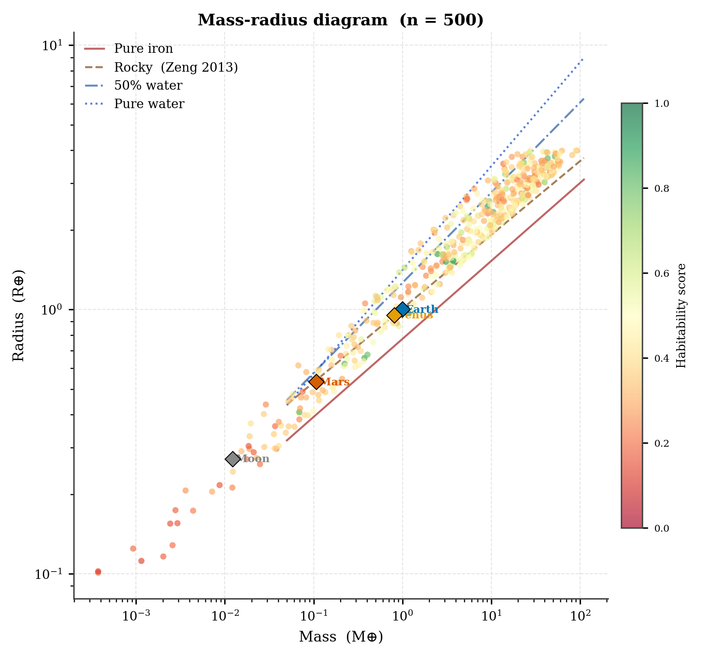
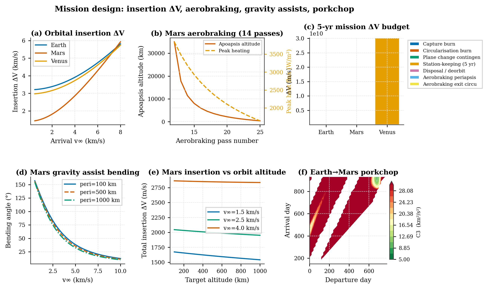

# Planet-RL Tutorial (end-to-end)

This tutorial walks through the whole Planet-RL project in one place:

- installing dependencies
- running the *orbital insertion* RL environment
- generating expert demonstrations
- behavioural cloning (BC) pretraining
- SAC training (with optional BC warm start)
- evaluation / generalisation checks
- optional “science & plots” demos

It includes two tracks:

- **Full track (science on)**: more realism, 18‑dim observations
- **Lite track (fast iteration)**: simplified planets, 10‑dim observations

> Run everything from the repository root (`Planet-RL/`), inside an activated venv.

---

## 0) Install

```bash
python -m venv .venv
source .venv/bin/activate

# Core (planet models + viz helpers)
pip install -e .

# RL stack (SAC/BC scripts)
pip install -e ".[rl]"
```

Sanity check:

```bash
python -c "import exorl; print('exorl import OK')"
```

---

## 1) Understand what you’re training

Planet-RL exposes **three** `gymnasium.Env`-style environments:

- **`OrbitalInsertionEnv`** (`exorl/core/env.py`)
  - **Goal**: capture + circularise into a near-circular target orbit (default: ~300 km)
  - **Action**: 3 continuous values in `[-1, 1]` (thrust magnitude + attitude controls)
  - **Observation**:
    - **full**: 18 floats (core orbital state + science/orbit design signals)
    - **lite**: 10 floats (core orbital state only)

- **`InterplanetaryEnv`** (`exorl/core/interplanetary_env.py`)
  - **Goal**: end-to-end mission episode (window selection → heliocentric cruise → capture)
  - **Action**: 4 continuous values in `[-1, 1]` (phase-dependent controls)
  - **Observation**: 28 floats (includes a capture phase that uses the same planetocentric state layout as `OrbitalInsertionEnv`)

- **`ScienceOpsEnv`** (`exorl/core/science_ops_env.py`)
  - **Goal**: post-insertion science operations (altitude/inclination choices + observe/downlink decisions)
  - **Action**: 4 continuous values in `[-1, 1]`
  - **Observation**: 16 floats

The main “starter” environment used by the BC→SAC scripts in this tutorial is `OrbitalInsertionEnv`.

You can quickly inspect an episode interactively:

```bash
python -c "from exorl.core.env import OrbitalInsertionEnv; env=OrbitalInsertionEnv(obs_dim=10); env.reset(); print(env.observation_space, env.action_space)"
```

---

## 2) Pick a tutorial track

### Full track (recommended for realism / generalisation research)

- Use **default settings** (science enabled)
- Use **18‑dim observations**
- Supports the **habitability curriculum**

### Lite track (recommended for fast RL iteration)

- Use `--lite` where available (or `lite_mode=True` in code)
- Uses **10‑dim observations**
- Disables expensive science stack hooks
- **Does not** support the habitability curriculum mode

---

## 3) Generate demonstrations (expert dataset)

### Full track

```bash
exorl generate-demos \
  --episodes 200 \
  --presets-only \
  --out demos/demos_presets_200.npz \
  --max-steps 4000 \
  --seed 0
```

### Lite track

```bash
exorl generate-demos \
  --lite \
  --episodes 200 \
  --presets-only \
  --out demos/demos_presets_200_lite.npz \
  --max-steps 4000 \
  --seed 0
```

---

## 4) Train BC (behavioural cloning)

BC turns demonstrations into a warm-startable policy.

### Full track

```bash
exorl pretrain-bc \
  --demos demos/demos_presets_200.npz \
  --out bc_model_presets_200 \
  --epochs 10 \
  --batch-size 256 \
  --obs-dim 18 \
  --seed 0
```

### Lite track

```bash
exorl pretrain-bc \
  --demos demos/demos_presets_200_lite.npz \
  --out bc_model_presets_200_lite \
  --epochs 10 \
  --batch-size 256 \
  --obs-dim 10 \
  --seed 0
```

Output to remember:

- `bc_model_*/bc_policy.zip` (SB3-compatible model you can use for warm start)

---

## 5) Train SAC (optionally warm-started from BC)

### Full track (fixed Earth baseline)

```bash
exorl train-sac \
  --mode fixed \
  --planet earth \
  --steps 20000 \
  --tag quick_full \
  --eval-freq 5000 \
  --eval-episodes 5 \
  --pretrain bc_model_presets_200/bc_policy.zip
```

### Lite track (fast baseline)

```bash
exorl train-sac \
  --lite \
  --mode fixed \
  --planet earth \
  --steps 20000 \
  --tag quick_lite \
  --eval-freq 5000 \
  --eval-episodes 5 \
  --pretrain bc_model_presets_200_lite/bc_policy.zip
```

Outputs:

- `training_runs/<run_name>/model_final.zip`
- `training_runs/<run_name>/eval_results.json`
- `training_runs/<run_name>/learning_curve.csv` (and sometimes `learning_curve.png`)

---

## 6) Evaluate generalisation

### Full track

```bash
exorl eval-generalisation \
  --model training_runs/<run_name>/model_final.zip \
  --planets earth mars venus moon titan \
  --episodes 10
```

### Lite track

```bash
exorl eval-generalisation \
  --lite \
  --model training_runs/<run_name>/model_final.zip \
  --planets earth mars \
  --episodes 10
```

Output:

- `generalisation_results.json` (written next to the model by default)

---

## 7) Optional: run the science / plotting demos

These are useful to understand what the simulation stack can produce, independent of RL training:

```bash
python examples/planets_demo.py
python examples/science_demo.py
python examples/transfer_viz_demo.py
python examples/population_demo.py --n 500
```

Expected outputs:

- figures under `figures/*`

Example outputs (generated by the commands above):






If the images don’t exist yet, run the demos in this section to generate them.

---

## 8) Common “gotchas” (and fixes)

- **Obs dim mismatch (BC warm start)**:
  - If your demos were created with 10‑dim observations, train BC with `--obs-dim 10` and train SAC with `--lite` (or `--no-science`).
  - If your demos are 18‑dim, keep science enabled through the whole pipeline.

- **Missing RL dependencies**:
  - Run `pip install -e ".[rl]"`.

- **Where did my outputs go?**
  - Demos: `demos/`
  - BC: `bc_model*/`
  - SAC: `training_runs/`
  - Figures: `figures/`
